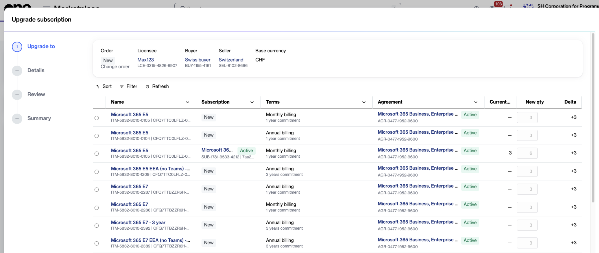

# Upgrade Microsoft 365 subscription

This tutorial explains how to upgrade a subscription.&#x20;

Upgrading means moving licenses from an existing subscription to an eligible higher plan. You can upgrade all licenses in a subscription or only a selected number of licenses.&#x20;

Depending on your upgrade, the licenses can be transferred to a new or existing subscription.

### Prerequisites

Ensure that the subscription you want to upgrade and its corresponding agreement are active.

### Upgrade a Microsoft 365 subscription



**Open the subscription**

To open the subscription:

1. Go to **Marketplace** > **Subscriptions**.
2. Select the subscription you want to upgrade.
3. On the subscription details page, select the dropdown arrow <path d=&#x22;M480-344 240-584l56-56 184 184 184-184 56 56-240 240Z&#x22;/></svg>" data-size="line">, then select **Upgrade**.



**Complete the Upgrade subscription flow**

In the guided **Upgrade subscription** flow, complete the following steps:&#x20;

1. **Upgrade to** – Select the required product and term you want to upgrade to. Then:
   * Review the **Subscription**, **New qty**, and **Delta** columns. The **Subscription** column indicates whether the licenses will be transferred to a new or existing subscription.
   * To perform a full upgrade, leave the default quantity unchanged. All licenses in the source subscription are selected for transfer.
   * To perform a partial upgrade, adjust the license quantity as needed. If the licenses are transferred to an existing subscription, enter the final number of licenses that the target subscription should have after the upgrade. This includes its existing licenses plus the licenses being transferred.&#x20;

<figure><figcaption>
Select the desired product, term, and license quantity in the <strong>Upgrade to</strong> step.
</figcaption></figure>

2. **Details** – Add any reference details or comments, then select **Next**.
3. **Review** – Review the order details and terms and conditions, then select **Place order**.

<figure><figcaption>
Review the upgrade details and place the order.
</figcaption></figure>

4. **Summary** – Select **View details** to open the order details page or select **Close**.



### Next steps

Your change order is submitted for processing. When the order is complete, the selected licenses are upgraded according to the upgrade option you chose.


After the upgrade is successfully processed, ensure that users are manually assigned to the upgraded licenses in the [Microsoft 365 admin center](https://admin.microsoft.com).

