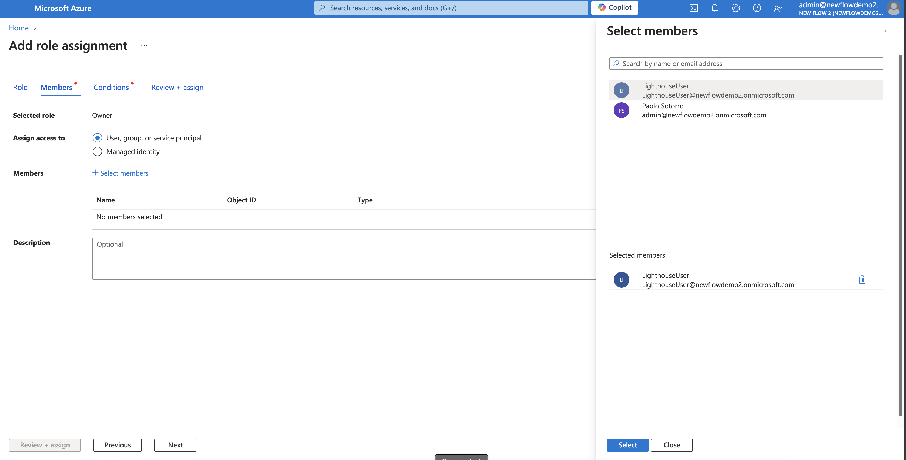
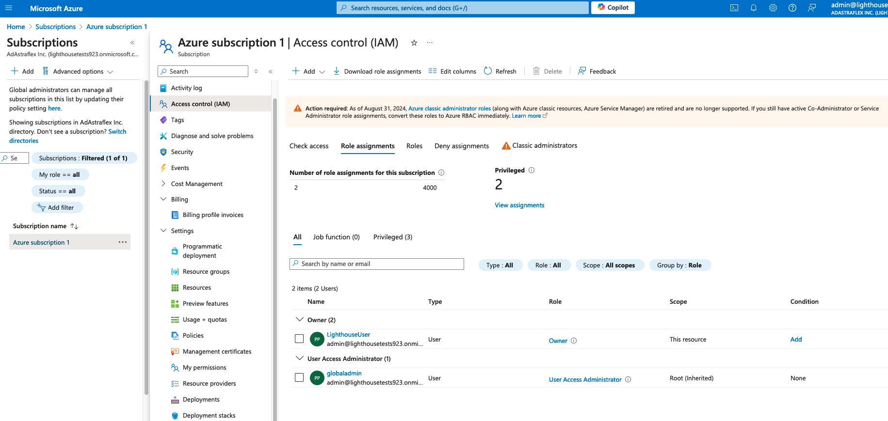

# Assign Subscription Owner Role

To [complete the Azure Lighthouse onboarding](complete-the-azure-lighthouse-onboarding.md), you must have the subscription owner role in Azure.&#x20;

Global administrators can assign the subscription owner role to the user who will complete the Azure Lighthouse onboarding.&#x20;

## Assigning the Owner role

To assign the Owner role:

1. Sign in to the [Microsoft Azure portal](https://portal.azure.com/) as a Global Administrator.
2. Verify that you have permission to add role assignments. To verify permissions:&#x20;
   1. In the **Search** bar, type **Microsoft** **Entra ID**.
   2. Go to the **Properties** tab.
   3. Under **Access management for Azure resources**, set the toggle to **Yes**. Your global admin username should be visible.
   4. Select **Save**.&#x20;

<figure><figcaption>
Properties tab
</figcaption></figure>

3. In the Search bar, type **Subscriptions**, and then on the **Subscriptions** page, select the required subscription.
4. In the left pane, select **Access control (IAM)**.
5. Select the **Role assignments** tab to view the role assignments at this scope. Then, select **Add** > **Add role assignment**.
6. On the **Privileged administrator roles** tab, select the **Owner** role and select **Next**.
7. On the **Members** tab, select the user to whom you want to assign the **Owner** role and select **Next**. You must select the user you want to use for the Azure Lighthouse onboarding.&#x20;

<figure><figcaption>
Add role assignment
</figcaption></figure>

8. On the **Conditions** tab, select **Allow user to assign all roles (highly privileged)** and then select **Next**.
9. On the **Review + assign** tab, select **Review + assign**.&#x20;

The **Owner** role is assigned to the user and displayed on the **Role assignments** tab in Azure:

<figure><figcaption>
Role assignments tab
</figcaption></figure>

## Next steps

After assigning the role in Azure, navigate to the **Orders** page in the Marketplace Platform to complete the onboarding steps. For step-by-step guidance, see [Complete Azure Lighthouse Onboarding](complete-the-azure-lighthouse-onboarding.md).&#x20;

## Related topics


[how-do-i-troubleshoot-lighthouse-activation-errors.md](../faqs/how-do-i-troubleshoot-lighthouse-activation-errors.md)

