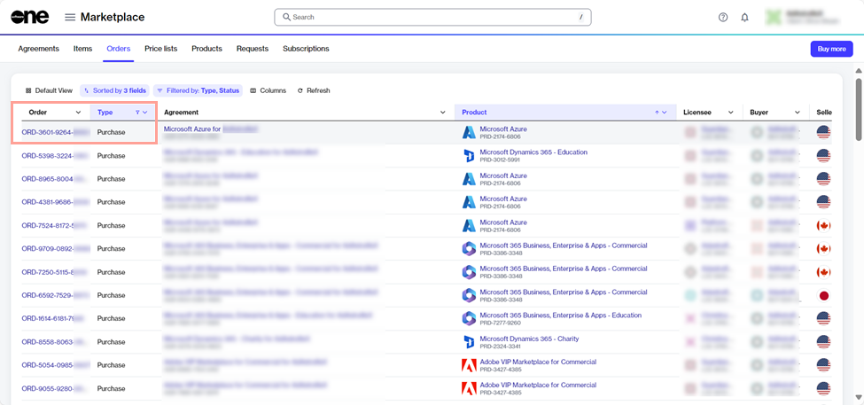
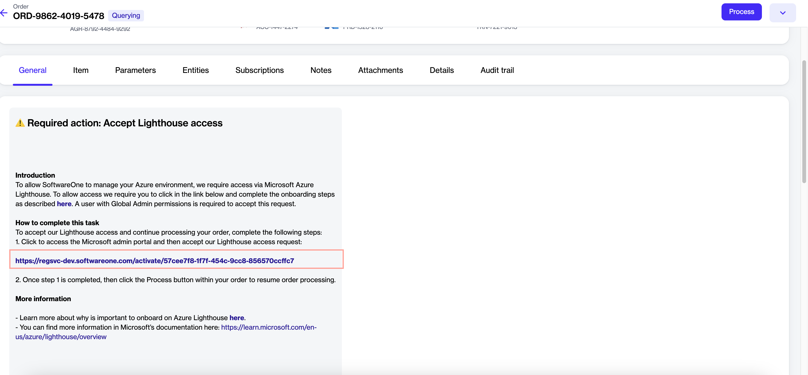
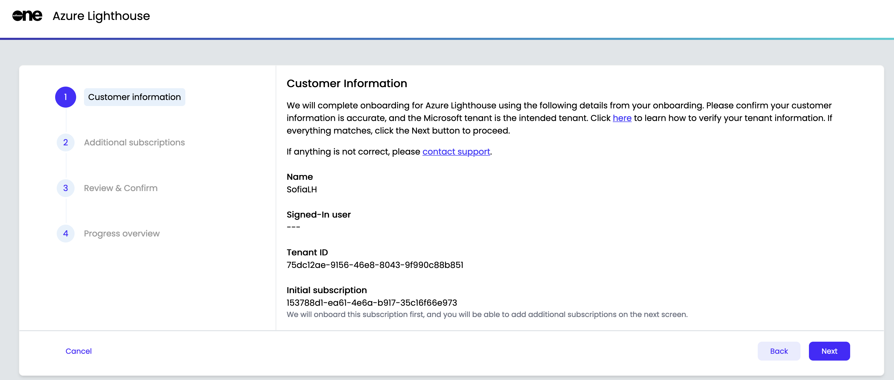
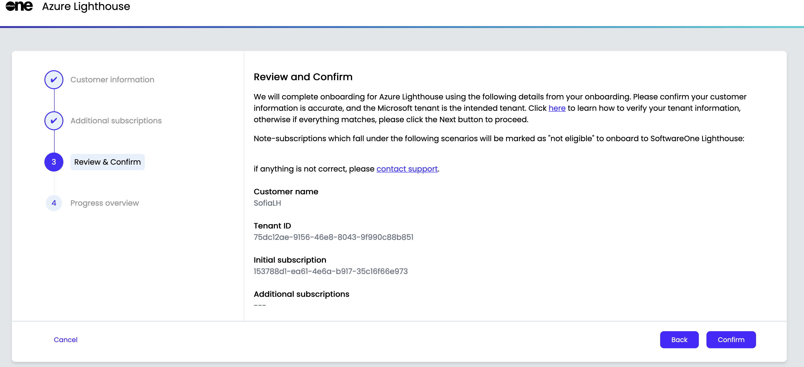
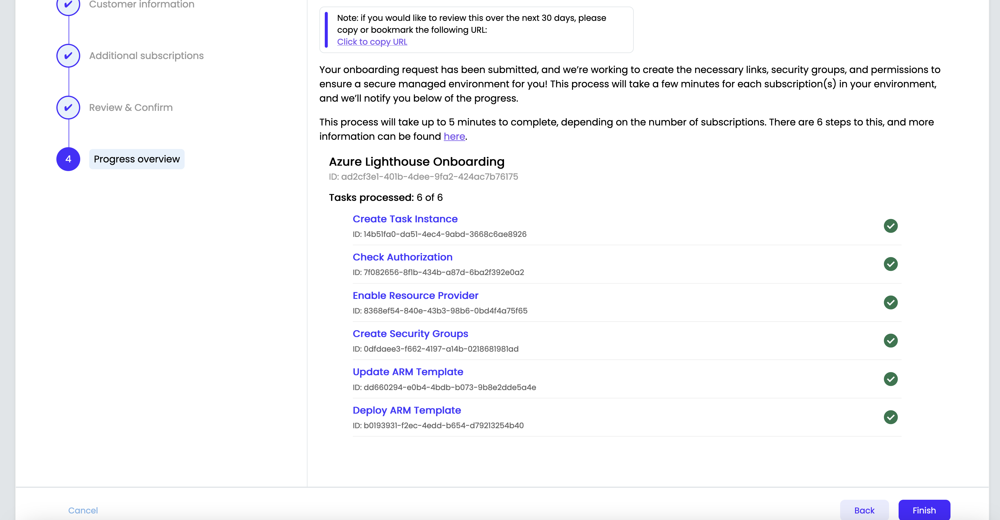

# Complete Azure Lighthouse Onboarding

Completing the Azure Lighthouse onboarding enables SoftwareOne to fulfill your Microsoft transactions, helping you streamline procurement and support.

To complete the onboarding successfully, you'll need the Microsoft **Azure Subscription Owner** role. For details on how to assign this role, see [Assign Subscription Owner Role](assign-subscription-owner-role.md).


The onboarding process for Azure Lighthouse can take up to 24 hours. This is because Microsoft needs to set up the necessary configurations and permissions for your new subscription, which can take a while, especially with multiple subscriptions and large amounts of data. If you still have issues after this time, [contact support](../../../help-and-support/contact-support.md).


## Completing Azure Lighthouse onboarding

To complete the onboarding:

1. Navigate to the **Orders** page.&#x20;
2. Select the required purchase order. The order details page is displayed.

<figure><figcaption>
Orders page
</figcaption></figure>

3. On the **General** tab, select the Lighthouse activation link.&#x20;

<figure><figcaption>
General tab
</figcaption></figure>

4. On the Azure Lighthouse Onboarding page, select **Start Activation**.

<figure><figcaption>
Azure Lighthouse onboarding page
</figcaption></figure>

5. On the Microsoft Sign-In page, use the **Azure Subscription Owner** credentials to sign in.&#x20;
6. On the **Permissions requested** page, review the permissions and select **Accept**.&#x20;

<figure><figcaption>
Permissions requested page
</figcaption></figure>

7. In the Azure Lighthouse onboarding wizard, do the following:
   1.  Review the onboarding details and select **Next**. You'll see a list of Azure subscriptions under the logged-in tenant.

       
<figure><figcaption>
Customer information
</figcaption></figure>

   2.  Select the checkbox for the subscription you want to onboard. Any subscription that has already been onboarded in Azure Lighthouse is considered ineligible and ignored in the next step.&#x20;

       
<figure><figcaption>
Additional subscriptions
</figcaption></figure>

   3.  Review the summary and select **Confirm**. The onboarding process begins, and the progress is displayed.&#x20;

       
<figure><figcaption>
Review &#x26; confirm 
</figcaption></figure>

   4.  When all tasks are completed, select **Finish**.&#x20;

       
<figure><figcaption>
Progress overview
</figcaption></figure>

## Next steps

After completing the activation, return to the order details page and select **Process** to change the order status from **Querying** to **Processing**.&#x20;

To learn more, see [Change Your Order's Status to Processing](../../../modules-and-features/marketplace/orders/set-an-order-to-processing.md).
