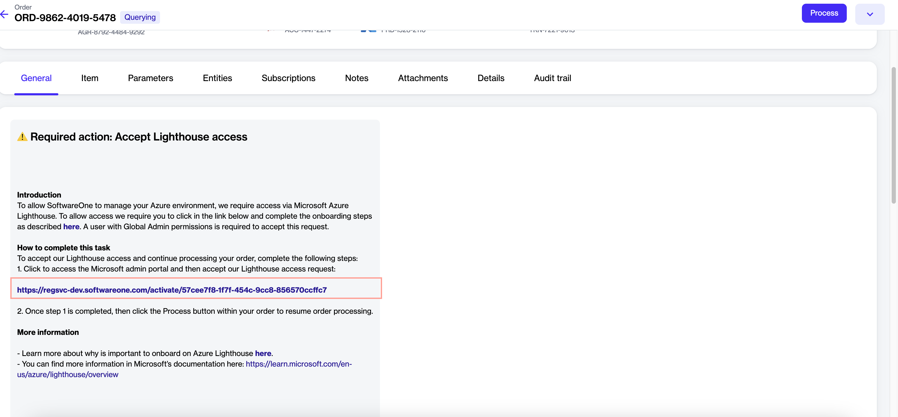
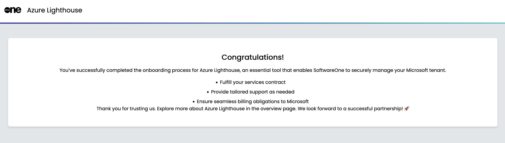

# Complete Azure Lighthouse Onboarding

Completing the Azure Lighthouse onboarding enables SoftwareOne to fulfill your Microsoft transactions, helping you streamline procurement and support.&#x20;

To complete the onboarding successfully, you'll need the Microsoft **Azure Subscription Owner** role. For details, see [Assign Subscription Owner Role](assign-subscription-owner-role.md).


The onboarding process for Azure Lighthouse can take up to 24 hours. This is because Microsoft needs to set up the necessary configurations and permissions for your new subscription, which can take a while, especially with multiple subscriptions and large amounts of data. If you still have issues after this time, [contact support](../../../help-and-support/contact-support.md).


## Completing Azure Lighthouse onboarding

Follow these steps to complete the onboarding process:

1. Sign to the [Client Portal ](https://portal.platform.softwareone.com)and navigate to the **Orders** page.&#x20;
2. Open the details page of the required purchase order. You can open the details page by clicking the order ID. &#x20;

<figure><figcaption>
Orders page
</figcaption></figure>

3. On the **General** tab, select the Lighthouse activation link.&#x20;

<figure><figcaption>
General tab
</figcaption></figure>

4. On the Azure Lighthouse Onboarding page, click **Start Activation**.

<figure><figcaption>
Azure Lighthouse onboarding page
</figcaption></figure>

5. On the Microsoft Sign-In page, use the **Azure Subscription Owner** credentials to sign in.&#x20;
6. On the **Permissions requested** page, review the permissions and click **Accept**.&#x20;

<figure><figcaption>
Permissions requested page
</figcaption></figure>

7. In the Azure Lighthouse onboarding wizard, do the following:
   1.  Review the onboarding details and click **Next**. You'll see a list of Azure subscriptions under the logged-in tenant.

       <figure><figcaption>
Customer information
</figcaption></figure>
   2.  Select the checkbox for the subscription you wish to onboard. Any subscription that has already been onboarded in Azure Lighthouse will be considered ineligible and ignored in the next step.&#x20;

       <figure><figcaption>
Additional subscriptions
</figcaption></figure>
   3.  Review the summary and click **Confirm**. The onboarding process begins and the progress is displayed.&#x20;

       <figure><figcaption>
Review &#x26; confirm 
</figcaption></figure>
   4.  When all tasks are completed, click **Finish**.&#x20;

       <figure><figcaption>
Progress overview
</figcaption></figure>

A confirmation message is displayed stating that the onboarding is complete.

<figure><figcaption>
Onboarding completion 
</figcaption></figure>

## Next steps

After completing the activation, return to the order's details page in the platform and click **Process** to change the order status from **Querying** to **Processing**. To learn more, see [Change Your Order's Status to Processing](../../../modules-and-features/marketplace/orders/set-an-order-to-processing.md).

## Related topics


[assign-subscription-owner-role.md](assign-subscription-owner-role.md)



[how-do-i-troubleshoot-lighthouse-activation-errors.md](../faqs/how-do-i-troubleshoot-lighthouse-activation-errors.md)

