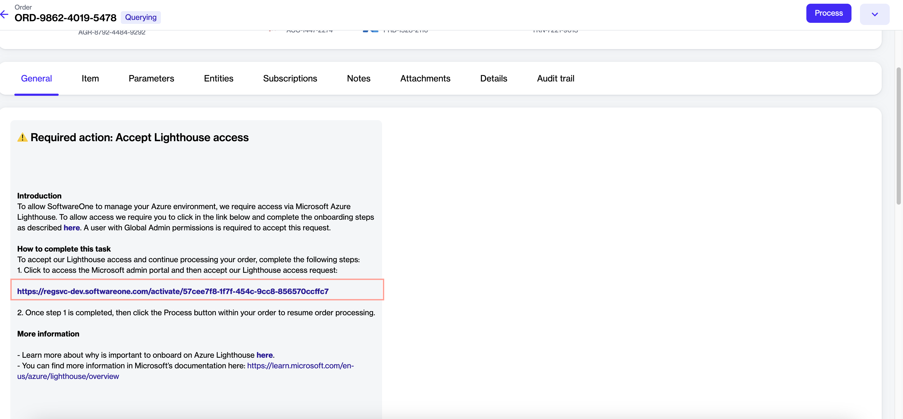

# Complete Azure Lighthouse onboarding

Completing the Azure Lighthouse onboarding enables SoftwareOne to fulfill your Microsoft transactions, helping you streamline procurement and support.

To complete the onboarding, you must have the **Owner** role on the Azure subscriptions being onboarded. For details, see [Assign subscription owner role](assign-subscription-owner-role.md).


The onboarding process can take up to 24 hours while Microsoft configures the necessary permissions. If you still have issues after this time, [contact support](../../../help-and-support/contact-support.md).


### Completing Azure Lighthouse onboarding

To complete the onboarding:

1. Go to **Marketplace** > **Orders**.
2. Select the required purchase order.&#x20;
3. On the **General** tab, select the Lighthouse activation link.&#x20;

<figure><figcaption>
Select the activation link on the <strong>General</strong> tab.
</figcaption></figure>

4. On the Azure Lighthouse Onboarding page, select **Start activation**.

<figure><figcaption>
Select <strong>Start activation</strong> to start onboarding.
</figcaption></figure>

5. On the Microsoft sign-in page, enter your **Azure Subscription Owner** credentials.&#x20;
6. Review the requested permissions, then select **Accept**.&#x20;
7. In the guided Azure Lighthouse flow, do the following:
   1. Review the onboarding details, then select **Next**. A list of Azure subscriptions under the logged-in tenant is displayed.
   2. Select the subscriptions to onboard. Subscriptions that are already onboarded are considered ineligible and ignored in the next step.&#x20;
   3. Review the summary, then select **Confirm**. The onboarding process begins, and the progress is displayed.&#x20;
   4. When all tasks are complete, select **Finish**.&#x20;

### Next steps

After completing the activation, return to the order details page in the Marketplace and select **Process**.&#x20;

This updates the order status from **Querying** to **Processing**, allowing SoftwareOne to process it further.

### Related topics


[do-i-need-to-set-up-azure-lighthouse-again-after-a-billing-transfer.md](../additional-resources/faqs/do-i-need-to-set-up-azure-lighthouse-again-after-a-billing-transfer.md)



[how-do-i-troubleshoot-lighthouse-activation-errors.md](../additional-resources/faqs/how-do-i-troubleshoot-lighthouse-activation-errors.md)

