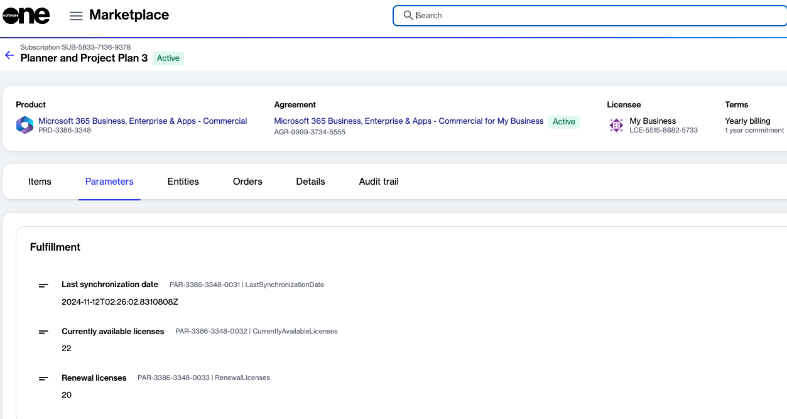

# How do I reduce subscription quantities

You can reduce the quantity of your subscription by editing the subscription directly. For information on how to remove licenses, see [How to Change License Quantity](../../../marketplace-platform/getting-started/marketplace-for-clients/adjust-subscription-quantity.md).

If the seat reduction is done within 7 days of ordering, the changes are applied in the Marketplace Platform and Microsoft.

However, if the reduction occurs outside of the 7-day window, the changes will be scheduled on the Microsoft side and will subsequently be applied in the Marketplace.&#x20;

To view your currently available licenses and the licenses scheduled for renewal, see the **Parameters** tab on the subscription details page.

<figure><figcaption>
The Parameters tab on the subscription details page.
</figcaption></figure>
