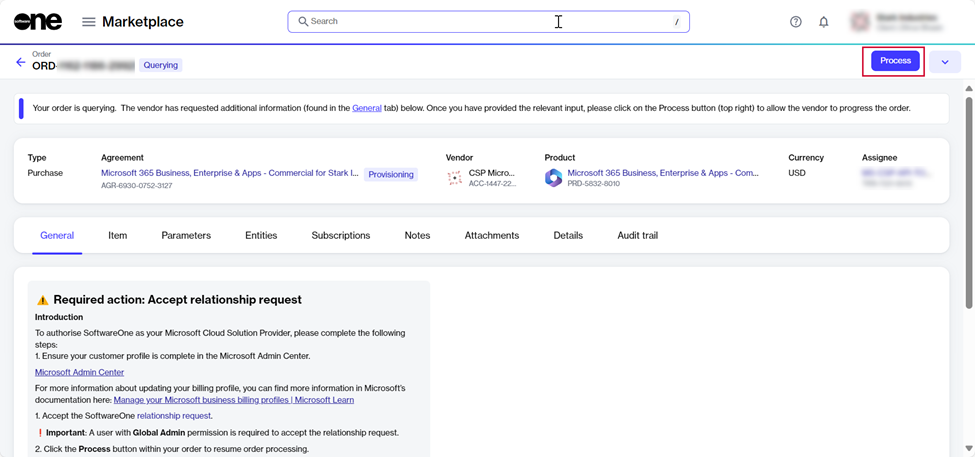

# How do I establish a partner relationship with SoftwareOne?

To ensure seamless management of your Microsoft 365, Dynamics 365, and Azure subscriptions, you'll need to establish a partner relationship with SoftwareOne.&#x20;

This allows SoftwareOne to fulfill your Microsoft transactions and manage products and services on behalf of your organization.&#x20;

To review and accept a partner relationship request:

1. Navigate to the **Orders** page on the platform. Then, select the required purchase order.&#x20;

<figure><figcaption>
Orders page
</figcaption></figure>

2.  Do one of the following:

    *   If the order is **Querying**, navigate to the **General** tab, where the partner relationship request URL is displayed. &#x20;

        <figure><figcaption>
URL on the General tab
</figcaption></figure>
    * If the order is in **Draft**, select **Edit** in the upper right. Then, on the **Select Items** page, select **Next** to see the relationship request URL.&#x20;

    <figure><figcaption>
URL on the Select items page
</figcaption></figure>
3. Select the URL. You'll be redirected to the Microsoft 365 Admin Center login page.
4. Use the Global Administrator credentials for the primary domain or tenant name listed in your purchase order.
5. Review the SoftwareOne partner information, then select **Next**.

<figure><figcaption>
Partner information
</figcaption></figure>

6. Select the link for the Microsoft Customer Agreement and read the agreement.&#x20;
7. Select the checkbox to acknowledge that you read the agreement, then select **Accept**.&#x20;

<figure><figcaption>
Read and accept the agreement
</figcaption></figure>

8. Return to your purchase order in the Marketplace Platform and select **Process** in the upper right to resume order processing.

<figure><figcaption>
Process option on the order details page
</figcaption></figure>
