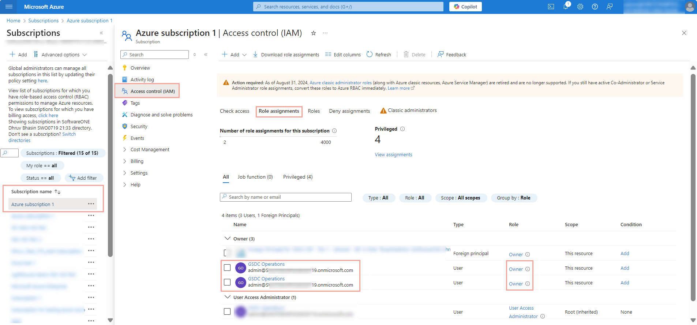

# How do I troubleshoot Lighthouse activation errors?

If you face an error during Lighthouse activation, it could be because of your role in Azure.&#x20;

Make sure that you are the owner of the subscription for which you are activating Lighthouse. Subscription owners have the **Azure Subscription Owner** role.

You can verify the role on the **Role assignments** tab in Azure.

<figure><figcaption>
Role assignments tab
</figcaption></figure>

To complete the Lighthouse onboarding, you must also meet the following requirements for your primary domain/tenant or Azure subscription:

* **Role** - Any
* **User type** - Member
* **User principal name** - Must have no reference to 'external'
* **Identity** - Must match the tenant’s name for the partnership

<figure><figcaption>
Entra ID Users Section
</figcaption></figure>
