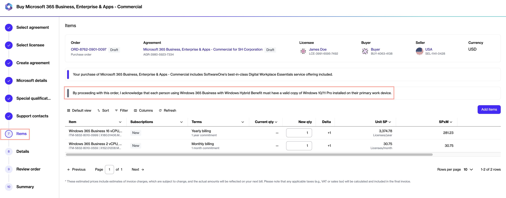
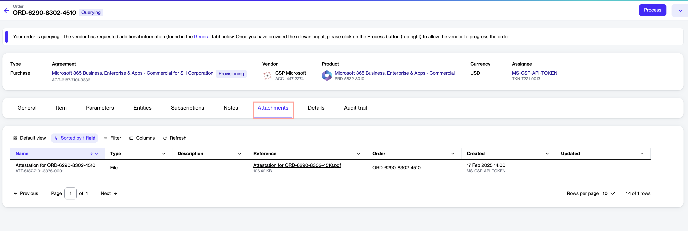

# What is offer attestation?

Offer attestation is a process that requires clients purchasing through the Marketplace to acknowledge certain terms and conditions before buying.&#x20;

Currently, the only offer requiring attestation before purchasing is Windows 365 Business with Windows Hybrid Benefit. It means when you are ordering Windows licenses with Hybrid Benefit, you must acknowledge that each person using the software has a valid copy of Windows 10/11 Pro installed on their primary work device.&#x20;

This verification step ensures compliance with Microsoft's licensing requirements and must be completed before placing the order.&#x20;

## How to acknowledge offer attestation

When ordering an item that falls under the Hybrid Use category, you'll see the following message on the **Items** page in the Purchase Wizard:

"By proceeding with this order, I acknowledge that each person using Windows 365 Business with Windows Hybrid Benefit must have a valid copy of Windows 10/11 Pro installed on their primary work device."&#x20;

The message is displayed for both purchase orders as well as change orders that include items requiring attestation.

<figure><figcaption>
Offer attestation in the Purchase Wizard
</figcaption></figure>

By clicking **Next** on the **Items** page, you confirm that you accept the attestation.&#x20;

After your order is placed, the **Attachments** tab on both the [Agreement details page](../../../modules-and-features/marketplace/agreements/#subscription-details) and the [Order details page](../../../modules-and-features/marketplace/orders/#subscription-details) displays a PDF file. This file contains the details of the person who confirmed the attestation, as well as the date and time of the attestation. The following image shows an example:

<figure><figcaption>
Attestation PDF on the Attachments tab
</figcaption></figure>

You can also see the attestation details through an [Audit trail](../../../modules-and-features/settings/audit-trail.md).&#x20;
