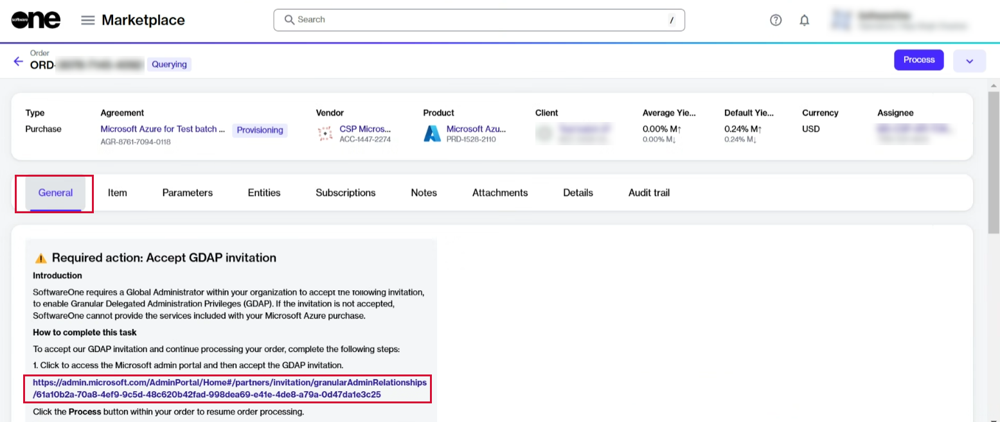
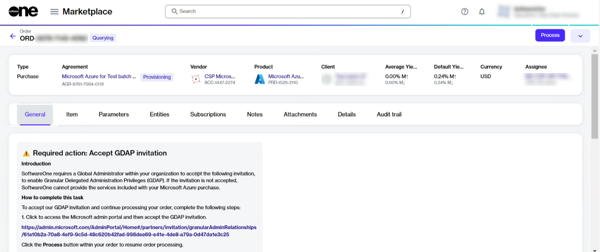

# Accept a GDAP relationship request

SoftwareOne requires Granular Delegated Administrative Privileges (GDAP) in your tenant to manage your Microsoft products and services. Without these privileges, we are unable to provide all the services associated with your purchase.&#x20;

After you have placed an order, you must accept our GDAP invitation. This invitation is provided as a URL on the order details page. When you select the link and log in as a Global Administrator, you are redirected to the Microsoft 365 admin center to complete the GDAP setup.

### Accepting a GDAP relationship request

To accept a GDAP relationship request:

1. Open the **Orders** page.
2. Select the required purchase order.&#x20;
3. On the **General** tab, select the GDAP URL.&#x20;

<figure><figcaption>
Select the GDAP URL.
</figcaption></figure>

4. Sign in to the Microsoft 365 admin center using an account that has **Global Administrator** permissions. You can use the Global Administrator credentials associated with the primary domain or tenant name stated in your purchase order.
5. Review the SoftwareOne partner information, then select **Next**.

<figure><figcaption>
Review the partner information.
</figcaption></figure>

6. Select the link for the Microsoft Customer Agreement and read the agreement.
7. Select the checkbox to acknowledge that you have read the agreement, then select **Accept**.

<figure><figcaption>
Accept the MCA.
</figcaption></figure>

8. Return to your purchase order in the Marketplace and select **Process** to resume order processing.

<figure><figcaption>
Select <strong>Process</strong> to move your order to the processing state.
</figcaption></figure>

