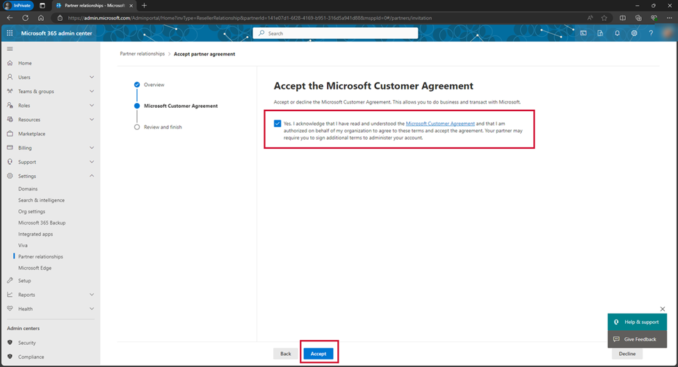

# Accept a GDAP Relationship Request

SoftwareOne requires Granular Delegated Administrative Privileges (GDAP) in your tenant to manage your Microsoft products and services. Without these privileges, we are unable to provide all the services associated with your purchase.&#x20;

After placing an order, you'll need to accept our GDAP invitation. The invitation is provided as a URL on the order details page. Once you click the link and log in as a Global Admin, you'll be directed to the Microsoft 365 admin center to complete the GDAP setup.

## Accepting a GDAP relationship request

Follow these steps to accept a GDAP relationship request:

1. Sign in to the [Marketplace Platform ](https://portal.platform.softwareone.com/)and navigate to the **Orders** page.
2. Open the details page of the required purchase order. You can open the details page by clicking the order ID.
3. On the **General** tab, select the GDAP URL. You'll be redirected to the Microsoft 365 admin center login page.

<figure><figcaption>
GDAP URL on the General tab
</figcaption></figure>

4. Sign in to the admin center with an account that has **Global Administrator** permissions. You may use the Global Administrator credentials associated with the primary domain or tenant name stated in your purchase order.
5. Review the SoftwareOne partner information and click **Next**.

<figure><figcaption>
Partner relationship overview
</figcaption></figure>

6. Select the link for the Microsoft Customer Agreement and read the agreement.
7. Select the checkbox to acknowledge that you read the agreement and click **Accept**.

<figure><figcaption>
Partner information
</figcaption></figure>

8. Return to your purchase order in the Marketplace Platform and click **Process** in the upper right to resume order processing. To learn more, see [Change Your Order's Status to Processing](https://open.gitbook.com/~site/site_NS3El/~/revisions/LgeUIoeUCxhXO2vTkTnx/modules-and-features/marketplace/orders/set-an-order-to-processing).

<figure><figcaption>
Process option on the order details page
</figcaption></figure>
