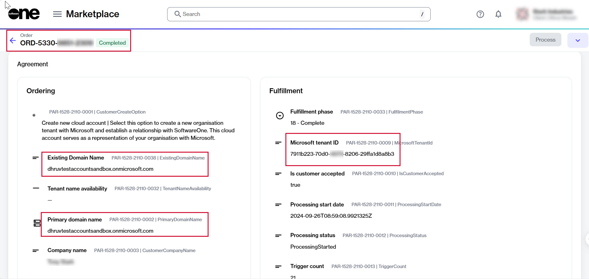
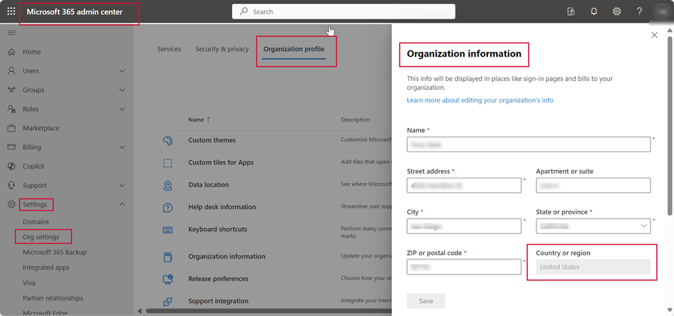

# GDAP and Partner Relationship Request Considerations

This topic describes the key points to keep in mind when establishing a GDAP or a partner relationship request with SoftwareOne. 

### Primary domain or tenant ID

To establish a GDAP admin relationship, make sure that your primary domain name or tenant ID in the purchase order matches the details in the Microsoft 365 Admin Center or Microsoft Azure Management Portal. 

There are a few ways you can verify your domain name and ID:

* **Using the Marketplace Platform** - You can verify your domain name and ID by navigating to the **Parameters** tab on the order details page.
  * The domain name for existing cloud accounts is displayed in the **Existing domain name** field. For new cloud accounts, the **Primary domain name** field shows the domain name. 
  * The tenant ID is displayed in the **Fulfillment** section.

<figure><figcaption>
The Parameters tab within the order details page.
</figcaption></figure>

* **Using Microsoft 365 Admin Center** - You can verify your domain name and ID by signing in to [Microsoft Entra admin center](https://entra.microsoft.com/) and navigating to **Settings** > **Domains**. The domain name is displayed on the **Domains** page.&#x20;

<figure><figcaption>
The Microsoft 365 admin center.
</figcaption></figure>

* **Using the Azure Portal** - You can verify your domain name and ID by signing in to the [Azure portal](https://portal.azure.com/) and navigating to **Entra ID** > **Overview**. Your registered primary domain is displayed in the **Name** section.

<figure><figcaption>
The Azure entra ID overview.
</figcaption></figure>

### Regional market restrictions

To establish a successful partner and GDAP admin relationship, both SoftwareOne and your organization must operate within the same Microsoft-defined regional market.&#x20;

For instance, SoftwareOne Brazil can only transact with customers in Brazil. For details on the CSP regions and markets, see the [Region availability](https://learn.microsoft.com/en-us/partner-center/enroll/regional-authorization-overview#africa-region-and-market) section in Microsoft's documentation.

The SoftwareOne region applicable to your order is also listed in your purchase order in the Marketplace Platform. To verify, open the details page of your order and select the **Details** tab. The **References** section displays the region.

<figure><figcaption>
The Details tab on the order details page.
</figcaption></figure>

You can also verify your organization's region in the Microsoft 365 Admin Center. To do this, sign in to the admin center and navigate to **Settings** > **Org Settings** > **Organization Information**. The name is displayed in the **Country or region** field.

<figure><figcaption>
The Organization information in Microsoft 365 Admin Center.
</figcaption></figure>

### Global administrator role requirements

The user setting up the partner and GDAP admin relationship must meet the following requirements for their primary domain or tenant:

* **Role** - Global Administrator
* **User type** - Member
* **User principal name** - Must have no reference to 'external'
* **Identity** - Must match the tenant’s name for the partnership

<figure><figcaption>
The Users section in Microsoft Entra ID.
</figcaption></figure>
