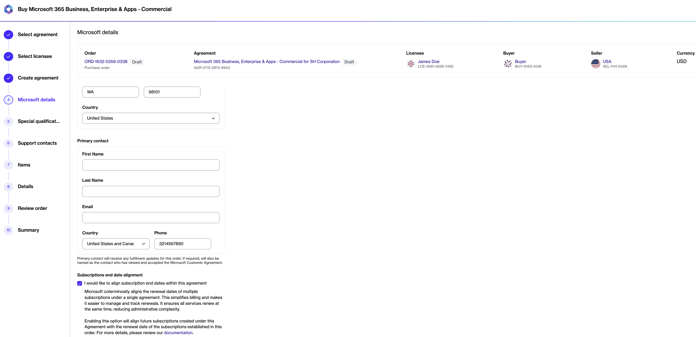

# Coterming Subscriptions

There are two ways to align subscription end dates, depending on whether you are creating a new agreement or updating an existing one.

## Coterming when creating a new agreement

To align subscription end dates when creating a new agreement:

1. Navigate to the **Products** page, then select the Microsoft NCE product.
2. Select **Buy now** to start the ordering process.
3. In the **Select agreement** step, select **Create agreement**.&#x20;
4. Complete all the steps in the wizard until you reach the **Microsoft details** step.
5. In the **Microsoft details** step, select the **I would like to align subscription end dates within this agreement** checkbox. When you select this checkbox, all future subscriptions created within this agreement will be cotermed and aligned with the subscriptions created during the initial purchase.

<figure><figcaption>
The option to align end subscription end dates. 
</figcaption></figure>

6. Complete all the remaining steps to place your order.&#x20;

## Coterming for an existing agreement

For existing agreements, coterminosity can only be enabled for future subscriptions by [contacting Marketplace Platform Support](../../../../help-and-support/contact-support.md) and providing the end date for cotermination.&#x20;

When contacting support, ensure that the date you provide corresponds with an active, existing subscription in your tenant.&#x20;

To find the date, in the [Microsoft Admin Portal](https://admin.microsoft.com/), go to the **Billing** > **Your products** page. Then, identify the cotermination date based on the renewal or expiration date of an active, license-based subscription.&#x20;


The subscription you want to consider must be under the same Microsoft Partner.


<figure><figcaption>
End dates in the Admin portal
</figcaption></figure>

When the date has been updated, all new subscriptions will coterminate with the specified end date. In the Marketplace Platform, you can view the end date in the **End date alignment** parameter on the agreement details page.
