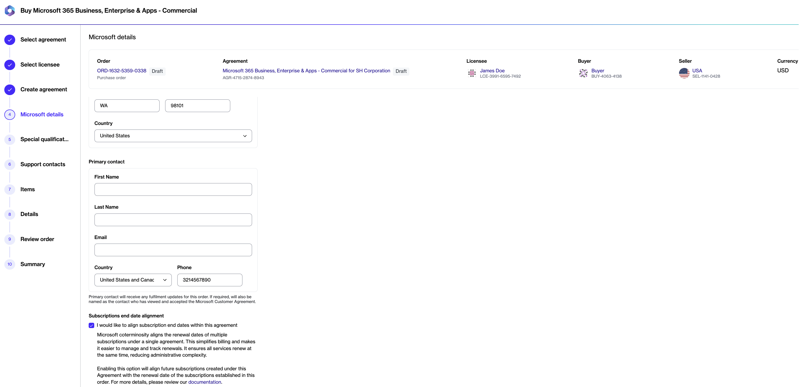
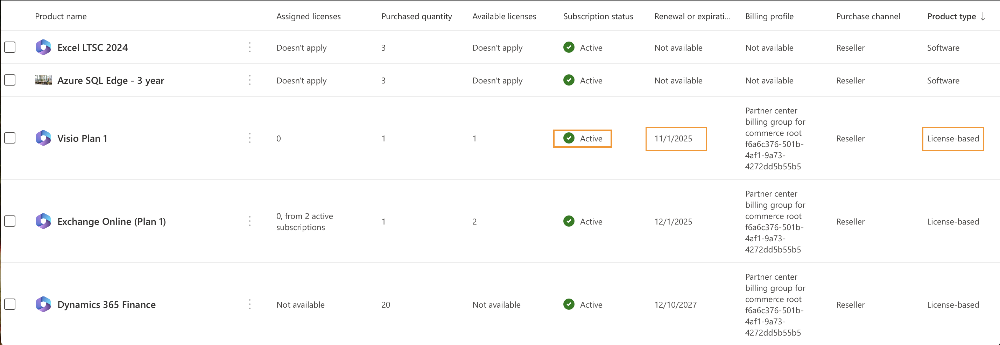

# Align subscription end dates

Subscription coterminosity (renewal alignment) allows multiple Microsoft subscriptions within an agreement to share the same renewal date.&#x20;

When coterminosity is enabled, new eligible subscriptions are aligned to an existing subscription end date instead of receiving their own independent renewal date. This helps simplify subscription management, billing, and renewals.&#x20;

### Limitations

The following limitations apply:

* Only license-based Microsoft NCE subscriptions support coterminosity.&#x20;
* Azure, Perpetual Software, and Software subscriptions don't support cotermination.
* Annual and triennial term subscriptions can't be coterminated with monthly subscriptions.
* Add-on subscriptions can be aligned to existing subscription end dates only if they belong to the same partner.
* Annual subscriptions can't be aligned with monthly subscriptions. If coterming is enabled using a monthly date and an annual subscription is ordered, a warning is displayed stating that the end date must be updated. Otherwise, the subscription is created without coterminosity. For more information, see [Subscription End Date Errors](subscription-end-date-errors.md).

#### Example

An agreement is created on 14 March 2025 with an annual subscription. On 25 April 2025, a second annual subscription is added to the same agreement.

* Without coterminosity, the second subscription renews on 25 April 2026. The monthly date will be 24 May 2025.
* With coterminosity, the subscription renews on 15 March 2026, aligning its renewal date with the existing subscription in the agreement. The monthly date will be 15 May 2025.

<table data-header-hidden><thead><tr><th width="337"></th><th></th><th></th></tr></thead><tbody><tr><td><strong>Subscription term</strong></td><td>Annual</td><td>Monthly</td></tr><tr><td><strong>Renewal date without coterminosity</strong></td><td>25 April 2026</td><td>24 May 2025</td></tr><tr><td><strong>Renewal date with coterminosity</strong></td><td>15 March 2026</td><td>15 May 2025</td></tr></tbody></table>

You can align subscription end dates when creating a new agreement or by updating an existing agreement.

### Enable coterminosity when creating an agreement

To align subscription end dates when creating a new agreement:

1. Open the **Products** page and select the required product.
2. Select **Buy now**.
3. Under **Select agreement**, select **Create agreement**.&#x20;
4. Complete the order process until you reach the **Microsoft details** step.
5. Select **I would like to align subscription end dates within this agreement**.&#x20;

<figure><figcaption>
Select the checkbox to align the end dates.
</figcaption></figure>

6. Complete the remaining steps to place your order.&#x20;

All future eligible subscriptions added to the agreement are automatically aligned to the subscription end date established during the initial purchase.

### Enable coterminosity for an existing agreement

To enable coterminosity for an existing agreement, contact [Marketplace Platform Support](../../../../../help-and-support/contact-support.md) and provide the subscription end date that should be used for alignment.

The date must belong to an active subscription in the same tenant.&#x20;

To identify the date:

1. Sign in to the [Microsoft Admin Center](https://admin.microsoft.com/).
2. Go to **Billing** > **Your products**.&#x20;
3. Identify the renewal or expiration date of an active, license-based subscription that future subscriptions should align with.&#x20;


The subscription must belong to the same Microsoft Partner relationship.


<figure><figcaption>
Identify the end date in the Microsoft Admin Portal.
</figcaption></figure>

After the alignment date is configured, all new eligible subscriptions added to the agreement will use the specified end date.

You can view the configured alignment date in the **End date alignment** field on the agreement details page.
