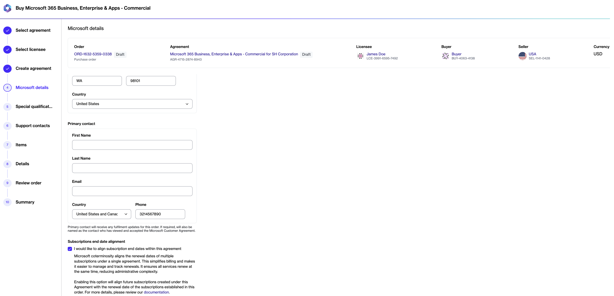
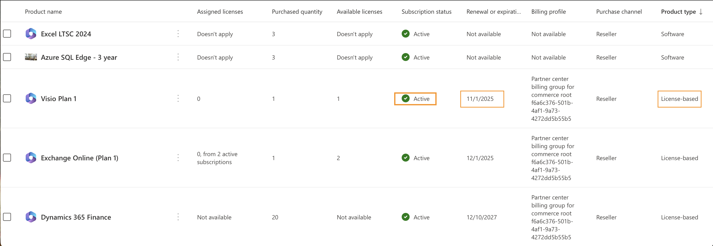

# Coterming subscriptions

You can align subscription end dates when creating a new agreement or by updating an existing agreement.

### Align subscription end dates when creating a new agreement

To align subscription end dates when creating a new agreement:

1. Open the **Products** page, then select the required product.
2. Select **Buy now**.
3. Under **Select agreement**, select **Create agreement**.&#x20;
4. Complete the order process until you reach the **Microsoft details** step.
5. Select **I would like to align subscription end dates within this agreement**.&#x20;

<figure><figcaption>
Select the checkbox to align the end dates.
</figcaption></figure>

6. Complete the remaining steps to place your order.&#x20;

All future eligible subscriptions added to the agreement will be automatically aligned to the subscription end date established during the initial purchase.

### Align subscription end dates for an existing agreement

To enable coterminosity for an existing agreement, contact [Marketplace Platform Support](../../../../../help-and-support/contact-support.md) and provide the subscription end date that should be used for alignment.

The date must belong to an active subscription in the same tenant.&#x20;

To find the date:

1. Sign in to the [Microsoft Admin Portal](https://admin.microsoft.com/).
2. Go to **Billing** > **Your products**.&#x20;
3. Identify the renewal or expiration date of an active, license-based subscription that future subscriptions should align with.&#x20;


The subscription must belong to the same Microsoft Partner relationship.


<figure><figcaption>
Identify the end date in the Microsoft Admin Portal.
</figcaption></figure>

After the alignment date is configured, all new eligible subscriptions added to the agreement will use the specified end date.

You can view the configured alignment date in the **End date alignment** field on the agreement details page.
