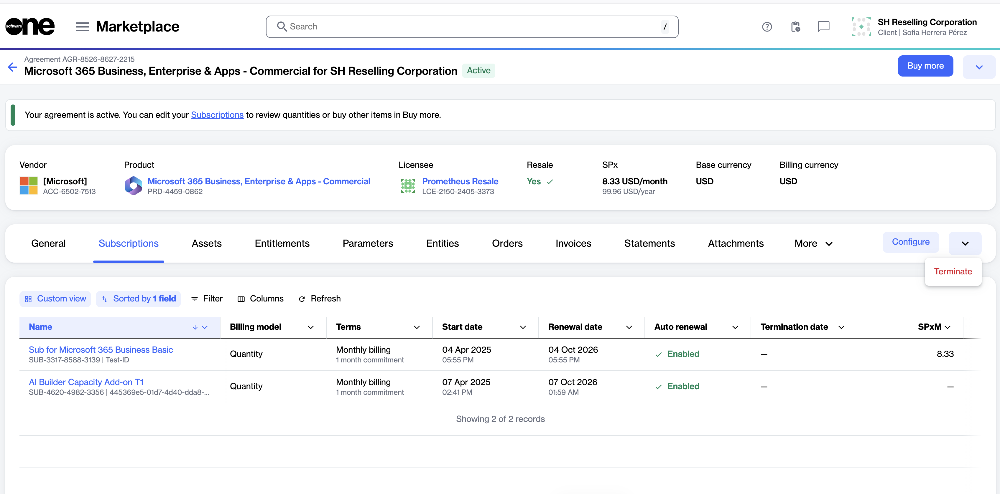

# Terminate multiple CSP subscriptions

You can terminate multiple subscriptions under the same agreement through a single termination order. This simplifies subscription management by allowing you to submit one request instead of creating separate termination orders for each subscription.

### Prerequisites

* The subscriptions must be eligible for cancellation.&#x20;
* NCE subscriptions can be cancelled within 7 days of purchase or renewal.

### Terminate multiple CSP subscriptions


Terminating a subscription may result in permanent loss of access to associated services, resources, and data.&#x20;

Termination cannot be undone. Before confirming the order, ensure that you understand the impact on the selected subscriptions and have taken necessary steps to protect your data.


To terminate multiple CSP subscriptions:

1. Go to **Marketplace** > **Agreements**.
2. Select the required agreement.
3. On the agreement details page, select the **Subscriptions** tab.
4. Select the dropdown and select **Terminate**.

<figure><figcaption>
Select <strong>Terminate</strong> to start the bulk termination process.
</figcaption></figure>

5. In the guided **Terminate subscription** workflow, do the following:
   1. Select the subscriptions you want to terminate. Select **Next**.
   2. Review the item and refund details. Select **Next**.
   3. Enter a reference ID and order notes, then select **Next**.
   4. Select the **I understand the risks and want to proceed with the termination** checkbox, then select **Place order**.
   5. Select **View order** to open the order details page, or select **Close**.

After placing the termination order, you can monitor its status on the **Order details** page.&#x20;

While the order is being processed, the subscription is displayed as **Terminating**. Once processing is complete, the subscription status changes to **Terminated**.
