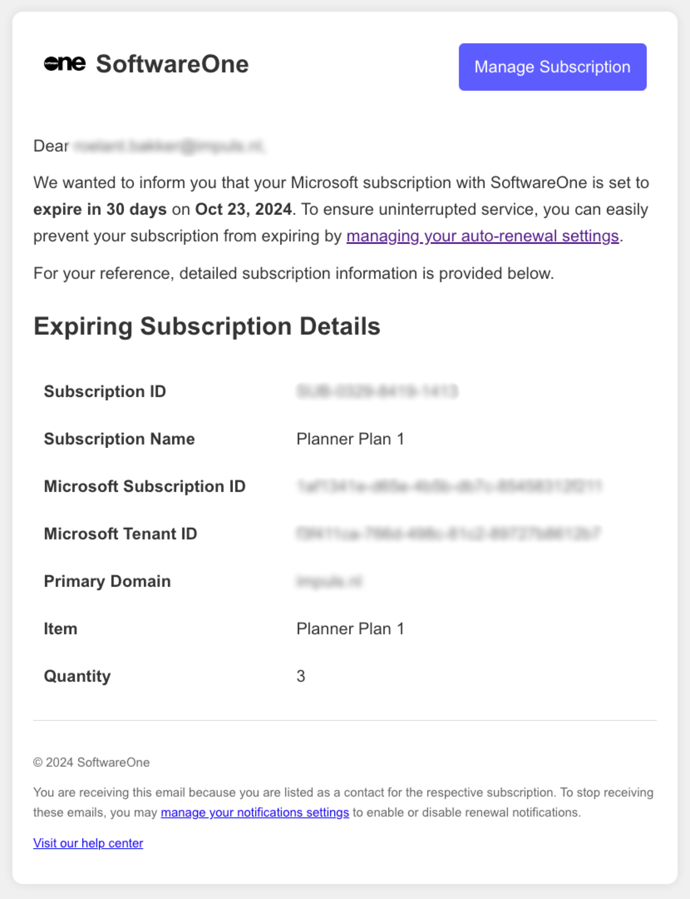
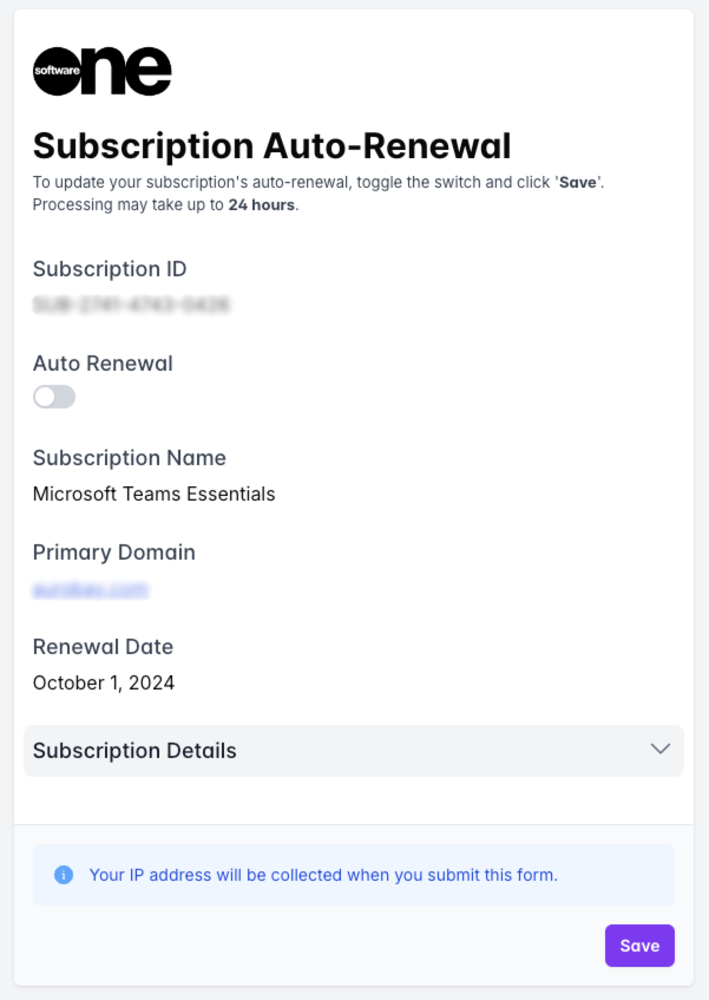

# Renewal Management

In the Marketplace Platform, renewal notifications are sent when your Microsoft CSP subscriptions are nearing expiration. We send these email notifications to inform you of your expiring subscriptions and to facilitate automatic renewal.

Renewal notifications are sent 1, 7, and 30 days before your subscription ends. If your subscription is currently active, you have the option to enable auto-renewal, which will allow your subscription to renew automatically.

Follow these steps to manage your subscription:

1. Open your renewal notification and click **Manage Subscription**.

<figure><figcaption>
Microsoft CSP renewal notification
</figcaption></figure>

2. In the **Subscription Auto-Renewal** form, turn on **Auto Renewal** to let your subscription renew automatically. If you don't enable auto-renewal, your subscription will expire on the renewal date.

<figure><figcaption>
Subscription auto-renewal form
</figcaption></figure>

3. Select **Save** to submit your request.&#x20;

You'll receive a confirmation email once your subscription status is updated. Note that processing your request might take up to 24 hours.


If you want to stop receiving emails about your upcoming renewals and subscription status, use the **Manage your notification settings** link in the renewal email to adjust your preferences.

