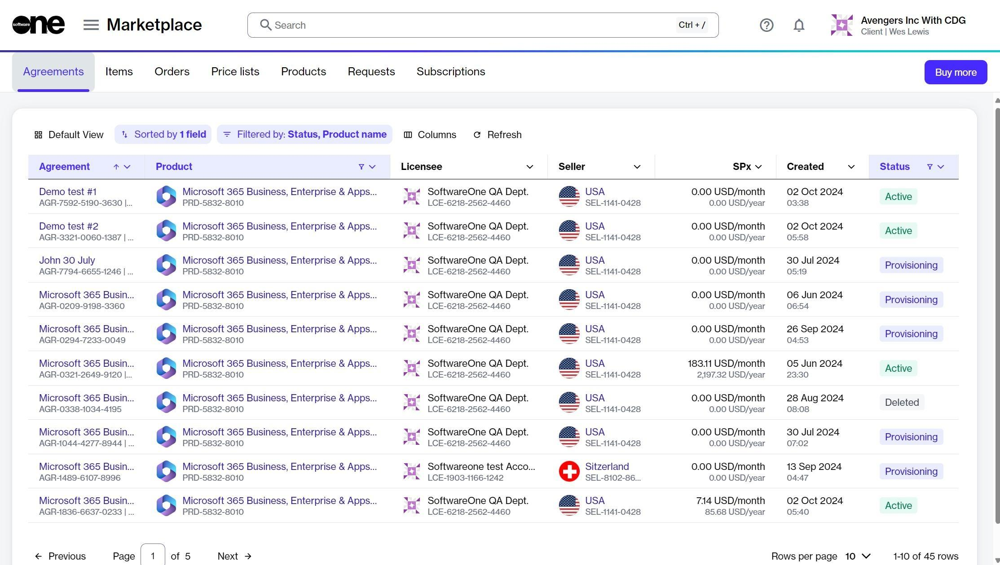

# Add New Products to Your CSP Agreement

This tutorial walks you through the steps required to add a new Microsoft product to your CSP agreement.&#x20;

In this scenario, we’ll be adding _Microsoft Power BI,_ but you can follow these instructions to add any Microsoft product to your existing agreement.

## Prerequisites 

Before starting this tutorial, make sure that the CSP agreement you want to add the product to is **Active**. You can check the agreement status on the **Agreements** page as well as its details page.&#x20;

You should also know how to navigate the platform to access your agreements & orders and [apply filters](../../../marketplace-platform/getting-started/interface/customize-the-data-grid.md#filter-data).

## 1. Open the agreement

1. Sign in to your account and navigate to the **Agreements** page.&#x20;
2. On the **Agreements** page, select the required CSP agreement.

<figure><figcaption>
Agreements page
</figcaption></figure>

3. On the agreement details page, click **Buy more**.

<figure><figcaption>
Buy more option on the details page
</figcaption></figure>

The purchase wizard starts and the **Items** step of the wizard is displayed.&#x20;

## 2. Select the new product

1. In the **Items** step, click **Add items**. A new window (also called **Select items**) will open displaying the available products that are available for you to order under this agreement.

<figure><figcaption>
Add items option
</figcaption></figure>

2. Use filters to find the product you need. In this example, we'll search for _Power BI_ using the following steps:
   1. Click the <path d=&#x22;M400-240v-80h160v80H400ZM240-440v-80h480v80H240ZM120-640v-80h720v80H120Z&#x22;/></svg>" data-size="line"> **Filter** option in the grid.
   2.  Click **Add another condition** and then use the dropdown to make the following selections:&#x20;

       1. Select **Product Item Name**.
       2. Set the filter to **Contains**.
       3. Type the name of the required product (in this case, _Power BI_).
       4. **Close** the filter box.

       <figure><figcaption>
Filter options in the grid
</figcaption></figure>
3. Select all the individual items from the list. You can select multiple checkboxes.&#x20;


When selecting items, be sure to verify the billing terms and the duration of the subscription.


<figure><figcaption>
List of available items
</figcaption></figure>

4. Click **Add items**. Your selected items are added to the agreement, and the **Select items** step is displayed again.
5. Set the quantity of your newly added items in the **New qty** field and click **Next**.&#x20;


In this step, you can also increase the quantities of your existing subscriptions.


<figure><figcaption>
Items step in the wizard
</figcaption></figure>

## 3. Place the order

Complete the remaining steps in the purchase wizard as follows:

1. In the **Details** step, add the additional ID and notes for your order and click **Next**. Note that it's optional to provide these details.
2. In the **Review order** step, verify the information and click **Place order** to finalize placing your orde&#x72;_._&#x20;
3. &#x20;Click **View details** to go to the order details page or click **Close** to close the page.

## Next steps

You can check the status of your new order on the **Orders** page or in the **Orders** tab on the agreement details page.

Note that once you place the order, the agreement status changes from **Active** to **Updating**. You will not be able to place any additional orders under this agreement until your current order has been processed and the agreement status is changed back to **Active**.&#x20;
