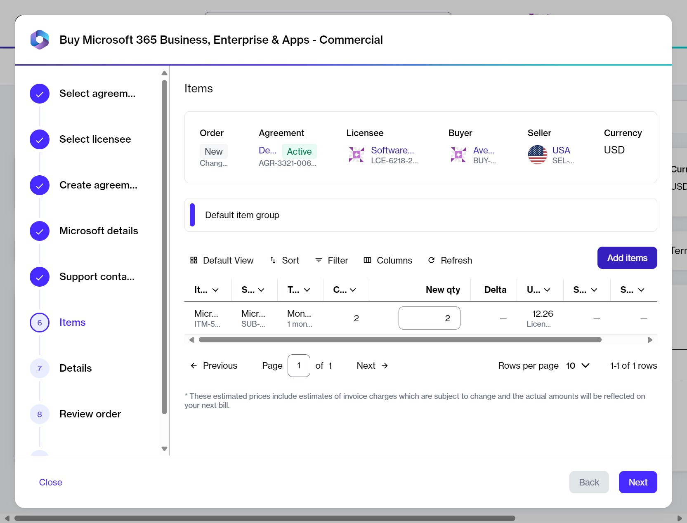

# Add New Products to Your CSP Agreement

This tutorial walks you through the steps required to add a new Microsoft product to your CSP agreement. 

In this scenario, we’ll be adding _Microsoft Power BI,_ but you can follow these instructions to add any Microsoft product to your existing agreement.

## Prerequisites 

Before starting this tutorial, make sure that the CSP agreement you want to add the product to is **Active**. You can check the agreement status on the **Agreements** page as well as its details page.&#x20;

You should also know how to navigate the platform to access your agreements & orders and [apply filters](../../../marketplace-platform/getting-started/interface/customize-the-data-grid.md#filter-data).

## Implementation



**Open the existing agreement**

Navigate to the **Agreements** page on the platform. Then, select the agreement. Make sure that the agreement's status is **Active**.&#x20;

On the agreement details page, select **Buy more.** The purchase wizard starts, and the Select Items section of the wizard is displayed.



**Add items to your order**

In the **Items** step, do the following:

1. In the **Items** step, select **Add items**. A new window containing all items you can order under this agreement opens.

<figure><figcaption>
Add items option
</figcaption></figure>

2. Use filters to find the product you need. In this example, search for _Power BI_ using the following steps:
   1. Select the <path d=&#x22;M400-240v-80h160v80H400ZM240-440v-80h480v80H240ZM120-640v-80h720v80H120Z&#x22;/></svg>" data-size="line"> **Filter** option in the grid.
   2. Select **Add another condition** and then use the dropdown to make the following selections:&#x20;
      1. Select **Product Item Name**.
      2. Set the filter to **Contains**.
      3. Type the name of the required product (in this case, _Power BI_).
      4. **Close** the filter box.
3. Select the individual items you need from the list. You can select multiple checkboxes.


When selecting items, be sure to verify the billing terms and the duration of the subscription.


4. Select **Add items**. Your selected items are added to the agreement, and the **Select items** page is displayed again.
5. Set the quantity of your newly added items in the **New qty** field. Then, select **Next**.&#x20;


In this step, you can also increase the quantities of your existing subscriptions.


<figure><figcaption>
Items step in the wizard
</figcaption></figure>



**Complete the remaining steps in the wizard**

1. In the **Details** step, provide reference details, like additional IDs or notes, and select **Next**.
2. In the **Review order** step, read the terms and conditions and the privacy statement. When done, select **Place order**.
3. In the **Summary** step, select **View details** to go to the order details page; otherwise, select **Close** to exit the wizard.



## Next steps

You can check the status of your new order on the **Orders** page or in the **Orders** tab on the agreement details page.

Note that once you place the order, the agreement status changes from **Active** to **Updating**. You will not be able to place any additional orders under this agreement until your current order has been processed and the agreement status is changed back to **Active**.&#x20;
