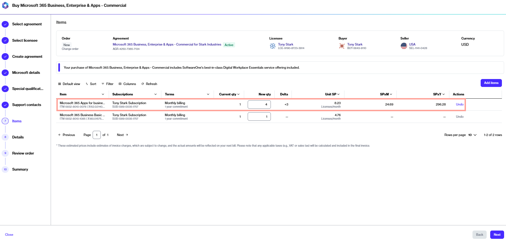

# Buy More Licenses for Microsoft 365 Subscription

This tutorial describes how you can order additional licenses for an existing Microsoft 365 subscription. Additional licenses can be ordered by placing a change order for the agreement.&#x20;




Watch this video guide explaining how to buy more licenses for an existing 365 subscription.


### Prerequisites

Before starting this tutorial, make sure that the agreement you want to use is in the **Active** state.

### Buying more licenses for your Microsoft 365 subscription 





To start the process:

1. Navigate to the **Products** page.&#x20;
2. From the list of products, select the desired Microsoft 365 product.
3. On the details page, select **Buy now** to start the ordering process.







1. **Create agreement** - Choose an active agreement and select **Next**.&#x20;
2. **Items** - Enter the total number of licenses in the **New qty** field.  For example, if you have 1 license and you want to add 3 more, enter the new quantity as 4. When done, select **Next**.

<figure><figcaption>
The Items section in the purchase wizard.
</figcaption></figure>

3. **Details** - Provide reference details, like additional IDs or notes, and select **Next**.
4. **Review order** - Read the terms and conditions and the privacy statement. When done, select **Place order**.
5. **Summary** - Select **View details** to go to the order details page. Otherwise, select **Close** to exit the wizard.



### Next steps 

Once you have placed your order, we verify the order details. If there are any issues with your order, the [order details ](https://docs.platform.softwareone.com/modules-and-features/marketplace/orders#subscription-details)page provides information about the problem and any actions you must take.
