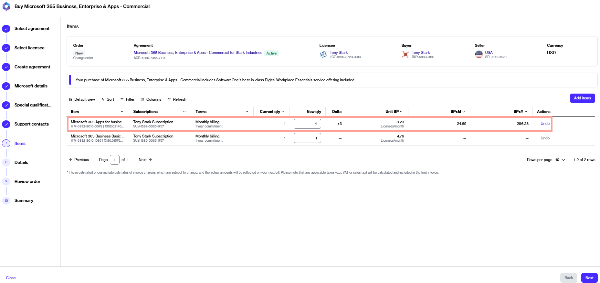

# Buy More Licenses for Microsoft 365 Subscription

This tutorial shows how you can order additional licenses for a Microsoft 365 subscription using an existing agreement. Additional licenses can be ordered by placing a change order through the platform.&#x20;


Video tutorial: How to buy more licenses for your 365 subscription


## Prerequisites

Before starting this tutorial, make sure that the agreement you want to use is in the **Active** state.

## Implementation 



### Launch the purchase wizard 

1. Navigate to the **Products** page in the platform.
2. Select the relevant Microsoft 365 product.
3. On the details page, select **Buy now** to start the purchase wizard.



### Select the agreement

1. Choose an active agreement from the list of your agreements.
2. Select **Next**. You'll be directed to the **Items** page in the wizard.



### Enter the new quantity 

1. In the **New qty** field, enter the total number of licenses you want. For example, if you have 1 license and you want to add 3 more, enter the new quantity as 4.
2. Select **Next**.&#x20;

<figure><figcaption>
Items section in the purchase wizard
</figcaption></figure>



### Provide reference details

1. Enter optional information, like additional IDs or notes related to your purchase
2. Select **Next**.



### Place your order

1. Review the details of your order. Make sure to read the terms and conditions associated with this purchase, including the privacy statement. By placing the order, you accept all terms.
2. Click **Place order** to complete your purchase.



## Next steps 

After placing your order, we will verify the details. If there are any issues with your order, the [order details ](https://docs.platform.softwareone.com/modules-and-features/marketplace/orders#subscription-details)page will provide information about the problem and any actions you may need to take.
