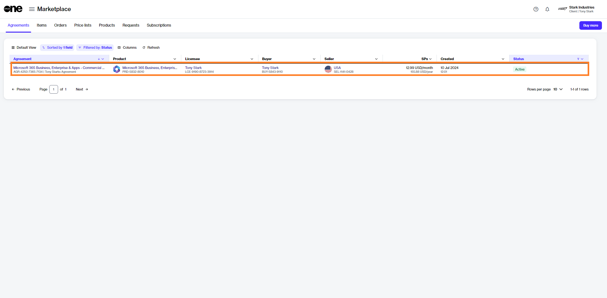
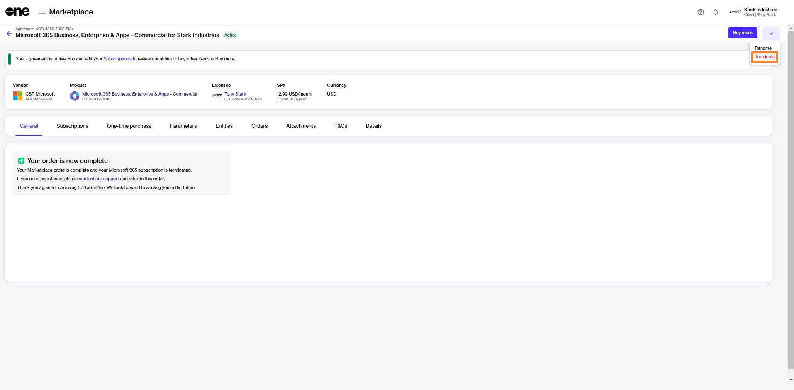
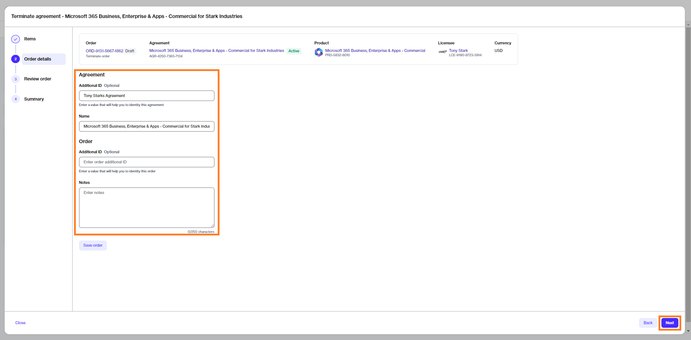

# Terminate All Subscriptions in Your Agreement

In this tutorial, you will learn how to terminate all of your Microsoft subscriptions that are associated with a specific agreement.&#x20;

As subscriptions are tied to agreements, the only way you can cancel all the subscriptions is by placing a termination order for that agreement.

## Prerequisites 

Before starting this tutorial, make sure that the agreement you wish to terminate is active. Agreements in any other state cannot be terminated.

You must also be familiar with how to navigate the platform to find and access the required agreement.

## 1. Open the agreement

1. On the agreements page, locate the agreement containing the subscriptions you want to terminate.&#x20;
2. Click the agreement name. The following image shows an example agreement:

<figure><figcaption>
Agreements page
</figcaption></figure>

3. Click the down arrow <path d=&#x22;M480-344 240-584l56-56 184 184 184-184 56 56-240 240Z&#x22;/></svg>" data-size="line"> in the upper right and select **Terminate**.&#x20;

<figure><figcaption>
Terminate option
</figcaption></figure>

The **Terminate agreement** wizard launches and the **Items** step of the wizard is displayed.

## 2. Terminate the agreement

1. In the **Items** step, review the details to make sure that all subscriptions have zero quantity. Click **Next**.

<figure><figcaption>
Items
</figcaption></figure>

2. Enter the optional reference information and click **Next**.&#x20;

<figure><figcaption>
Details
</figcaption></figure>

3. In the **Review order** step, click **Next** to place the termination order for the agreement.&#x20;

<figure><figcaption>
Review order
</figcaption></figure>

4. Click **View order** to navigate to the order details page. Otherwise, click **Close** to close the **Summary** page.

## Next steps 

A termination order is created for the agreement and submitted to the vendor for processing.&#x20;

After you place the order, the agreement status changes from **Active** to **Updating**. You will not be able to place any additional orders under this agreement.&#x20;

Once the termination order is processed, the status of the agreement and all subscriptions within the agreement will change to **Terminated**.
