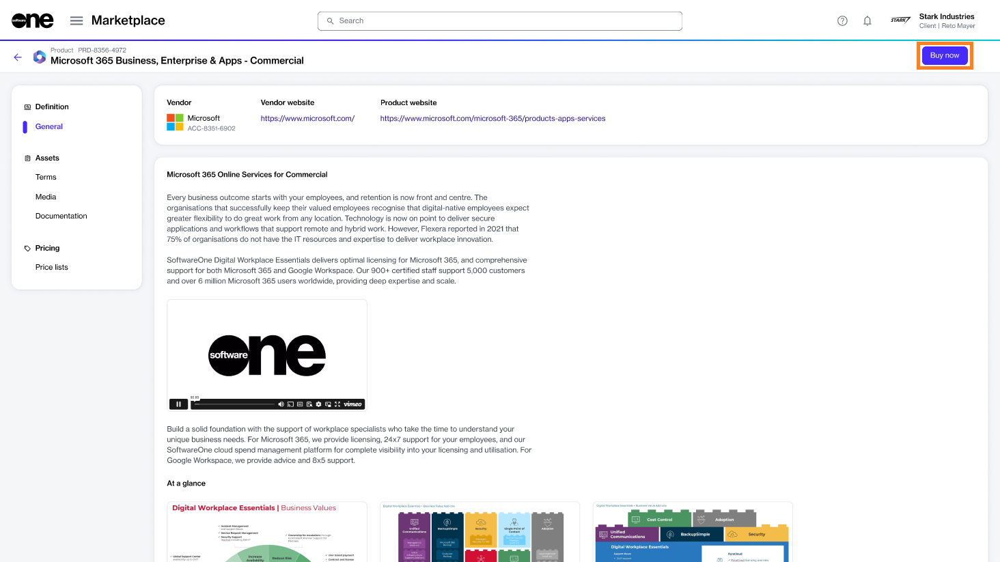

# Order Microsoft 365 Subscription for Existing Tenant

This tutorial describes how you can order a Microsoft 365 subscription by creating a new Marketplace agreement.

When setting up a new agreement, you can either create a new Microsoft account or use an existing one. This tutorial focuses on how to connect your existing cloud account.&#x20;




Watch this video guide explaining how to order Microsoft 365 subscription for an existing tenant.


## Prerequisites 

Before starting this tutorial, make sure you have the following:

* Your Microsoft tenant name.&#x20;
* A Marketplace licensee in the **active** state or permission to [create a new licensee](../../../modules-and-features/settings/licensees/create-licensees.md) (if you don't want to use an existing licensee). You'll need to select the licensee when you are creating the agreement.&#x20;

## Ordering a Microsoft 365 subscription for an existing tenant





To start the process:

1. Navigate to the **Products** page.
2. Select the desired Microsoft 365 product, for example, **Microsoft 365 Business, Enterprise & Apps - Commercial.**
3. On the details page, select **Buy now**.

<figure><figcaption>
Buy now option on the details page
</figcaption></figure>








1. **Create agreement** - Select **Create agreement** to start creating your new agreement.
2. **Select licensee** - Choose if you want to use an existing licensee or create a new one. In this tutorial, we'll select an existing licensee. You can add a new licensee by selecting **Add licensee**. See [Create Licensees](../../../modules-and-features/settings/licensees/create-licensees.md) for instructions.
3. **Create agreement** - Select **Connect existing cloud account** to connect your existing tenant. Then, select **Next**. Note that if you choose this option, the global administrator of your Microsoft account will need to accept the relationship request.
4. **Microsoft details** - Enter the details for your Microsoft account:
   1. Enter the name of your existing tenant.
   2. Fill out the contact form. You'll need to provide the first and last name, email address, and phone number of the person who will manage your account.&#x20;
   3. Select **Next**. The platform will validate your Microsoft tenant details. If no tenant is found, a message is displayed. You'll need to fix the error to proceed.
5. **Special qualifications** - Select the checkbox if your organization is a [state-owned](https://www.microsoft.com/en-us/legal/compliance/anticorruption/criteria) entity. Otherwise, leave it clear. A company is classified as state-owned if it is either controlled by the government or performs functions that the government considers its own.
6. **Support contacts** - Enter the contact details of your support administrator and choose your preferred support language. Select **Next**.
7. **Items** - Do the following:
   1. Choose the items you want to order and then select **Add items**. You can select multiple items. When the items are added, the **Select items** section is displayed.
   2. Review and adjust the license quantity as required.
   3. If applicable, [read the offer attestation](../faqs/what-is-offer-attestation.md). The offer attestation is only displayed for Windows 365 Business with the Windows Hybrid Benefit.&#x20;
   4. Select **Next**.
8. **Details** - Provide reference details, like additional IDs or notes, and select **Next**.
9. **Review order** - Read the terms and conditions and the privacy statement. When done, select **Place order**.
10. **Summary** - Select **View details** to go to the order details page. Otherwise, select **Close** to exit the wizard.



## Next steps

Once you have placed your order, we'll verify the order details, including the Microsoft tenant ID, and create your new subscription under your existing tenant. If there are issues with your order, the [order details ](https://docs.platform.softwareone.com/modules-and-features/marketplace/orders#subscription-details)page will provide information about the problem and any actions you may need to take.
