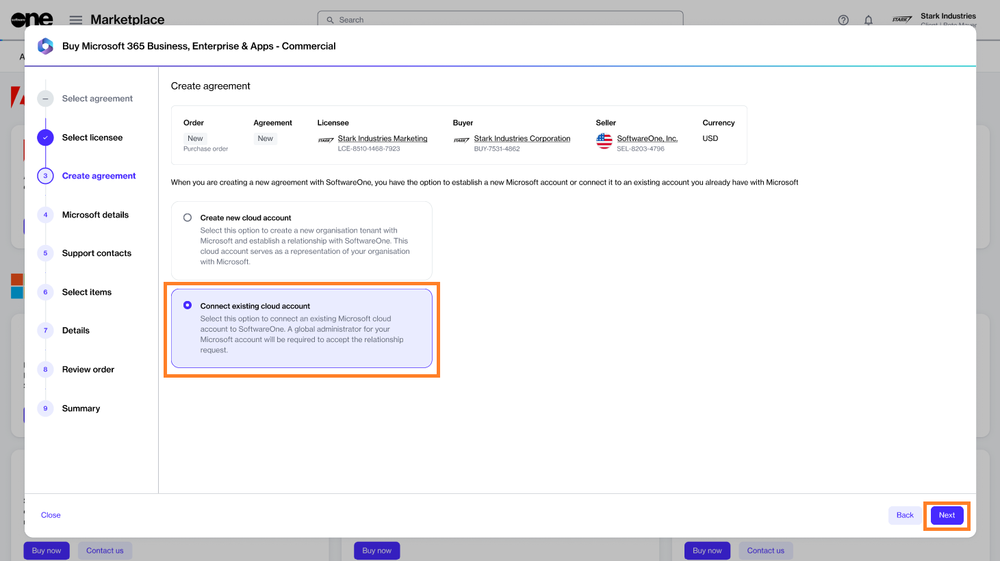

# Order Microsoft 365 Subscription (Existing Tenant)

This tutorial shows how to order a Microsoft 365 subscription for an existing tenant.&#x20;

In this scenario, you'll set up a new Marketplace agreement and then connect your existing Microsoft tenant.&#x20;


Video tutorial: How to order Microsoft 365 subscription for an existing tenant


## Prerequisites 

Before starting this tutorial, make sure you have the following:

* Your Microsoft tenant name.&#x20;
* A Marketplace licensee in the **active** state or permission to [create a new licensee](../../../modules-and-features/settings/licensees/create-licensees.md) (if you don't want to use an existing licensee). You'll need to select the licensee when you are creating the agreement.&#x20;

## 1. Select the product

1. Navigate to the **Products** page (**Marketplace** > **Products**) and select **Microsoft 365 Business, Enterprise & Apps - Commercial**.

<figure><figcaption>
Products page
</figcaption></figure>

2. Click **Buy now** on the details page.

<figure><figcaption>
Details page
</figcaption></figure>

The purchase wizard starts and the **Select agreement** section displays.

## 2. Select agreement

Click **Create new agreement** to set up your new agreement.

<figure><figcaption>
Select agreement
</figcaption></figure>

## 3. Select licensee

1. Choose the licensee you want to use. In this tutorial, we'll select an existing licensee, as shown in the following image. However, you can add a new licensee by clicking **Add licensee** and following the instructions in [Create Licensees](../../../modules-and-features/settings/licensees/create-licensees.md).
2. Click **Next**.&#x20;

<figure><figcaption>
Select licensee
</figcaption></figure>

## 4. Connect your Microsoft tenant

Select **Connect existing cloud account** and click **Next**.

<figure><figcaption>
Create agreement
</figcaption></figure>

## 5. Provide Microsoft account details

1. Enter your existing Microsoft domain and the details of your contact person who will receive updates about this order. Click **Next**.

<figure><figcaption>
Agreement details
</figcaption></figure>

## 6. Add support contacts

1. Enter the contact you want to use for support and your preferred support language. The contact details are populated from the **Licensee** information, but you can change the details if required.&#x20;
2. Click **Next**.&#x20;

<figure><figcaption>
Support contacts
</figcaption></figure>

## 7. Select items

1. Choose the required items and click **Add items** to add those items to your order. You can select multiple items as shown in the following image.

<figure><figcaption>
Select items
</figcaption></figure>

2. Update the quantity as needed and then click **Next**.

<figure><figcaption>
New quantity
</figcaption></figure>

## 8. Provide agreement and order details

1. (Optional) Add your order and agreement details as necessary so you can identify them easily.&#x20;
2. Click **Next**.

<figure><figcaption>
Details
</figcaption></figure>

## 9. Place your order

1. Review the details of your order and make sure to read all terms and conditions, including the privacy statement. By placing the order, you accept all terms.
2. Click **Place order** to complete your purchase.

<figure><figcaption>
Review order
</figcaption></figure>

## 10. View order summary

1. Review your order summary and the latest status message.&#x20;
2. Click **View Order** to navigate to the order details page. Otherwise, click **Close** to close the **Summary** page.

<figure><figcaption>
Summary
</figcaption></figure>

## Next steps

After your order is submitted for processing, we'll create your new subscription under your existing tenant.
