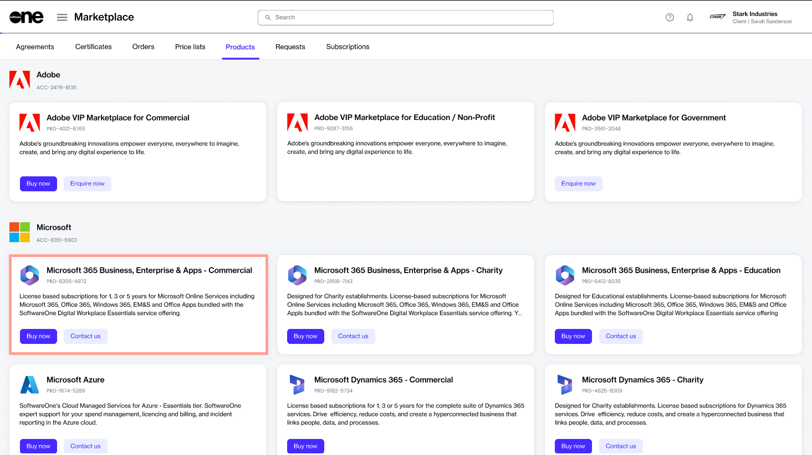
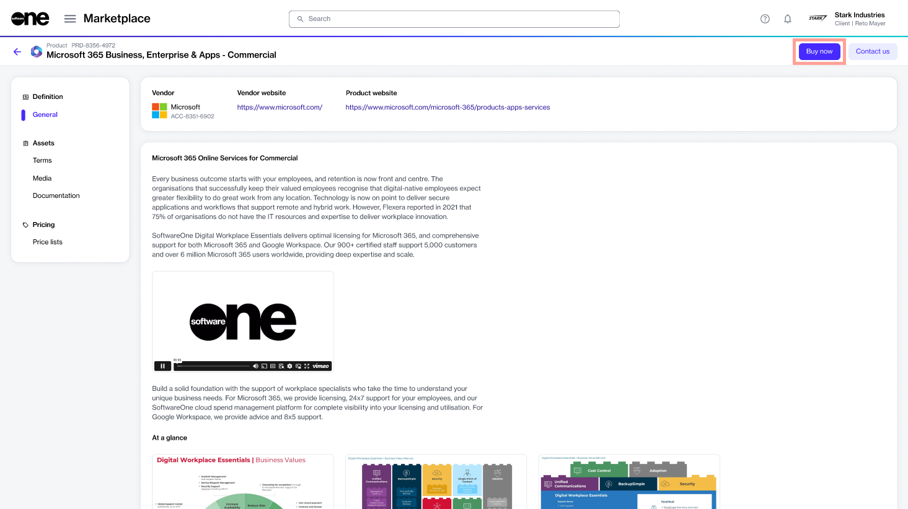
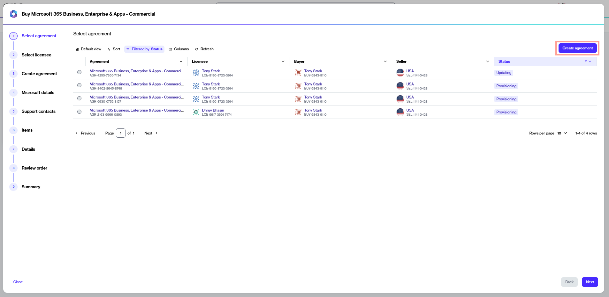
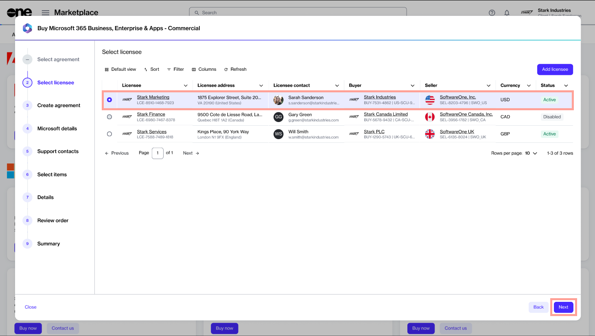
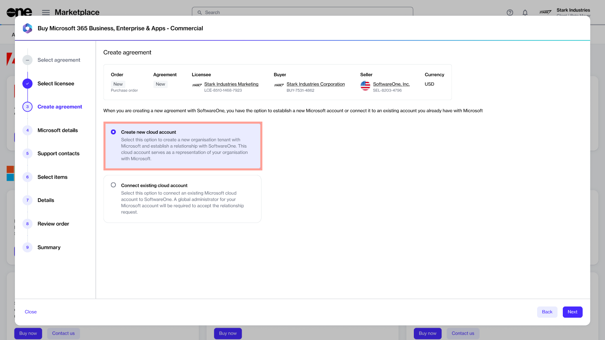
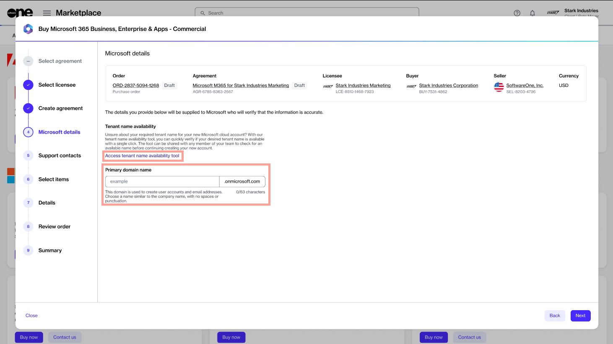

# Order Microsoft 365 Subscription (New Tenant)

This tutorial walks you through the steps required to order a Microsoft 365 subscription by setting up a new agreement.

In this scenario, you'll be setting up a new Microsoft tenant.&#x20;


Video tutorial: How to order Microsoft 365 subscription for a new tenant


## Prerequisites 

Before starting this tutorial, make sure you have the following:

* A licensee in the **active** state or permission to [create a new licensee](../../../modules-and-features/settings/licensees/create-licensees.md) if you don't want to use an existing active licensee. Licensee selection is required when setting up a new agreement.&#x20;
* Your company details, like the company name, registration ID, and address. These details are required for creating a new Microsoft tenant.&#x20;
* The contact details of the person who will manage your Microsoft account.&#x20;

## 1. Launch the purchase wizard

1. On the **Products** page (**Marketplace** > **Products**), select **Microsoft 365 Business, Enterprise & Apps - Commercial**.

<figure><figcaption>
Products page
</figcaption></figure>

2. Click **Buy now** in the upper right on the details page. The purchase wizard starts and the **Select agreement** step of the wizard is displayed.

<figure><figcaption>
Product details page
</figcaption></figure>

## 2. Create agreement

Click **Create agreement** to set up your new agreement in the platform.

<figure><figcaption>
Create agreement option
</figcaption></figure>

## 3. Select licensee

1. Choose the licensee you want to use for this agreement. In this tutorial, we'll select an existing licensee, but you can add a new licensee by clicking **Add licensee**. For more information, see [Create Licensee](../../../modules-and-features/settings/licensees/create-licensees.md).
2. Click **Next**.&#x20;

<figure><figcaption>
Select a licensee
</figcaption></figure>

## 4. Create a new tenant

1. Select **Create new cloud account** to create a new organisation tenant with Microsoft and establish a relationship with SoftwareOne.&#x20;
2. Click **Next**.

<figure><figcaption>
Create account option
</figcaption></figure>

## 5. Provide Microsoft account details

1. (Optional) Click **Access tenant name availability tool** to check if the name you want to provide for the new Microsoft cloud account is available.&#x20;
2. Enter the tenant name you want to use on the onmicrosoft.com domain. Make sure that the name doesn't include punctuation marks or spaces.&#x20;
3. Click **Next**. The platform validates the details you entered.

<figure><figcaption></figcaption></figure>

4. Fill out the contact form and click **Next**. You'll need to provide the following details:
   1. Company name.
   2. Company registration ID or tax number.
   3. Company address, including city and zip/postal code.
   4. Contact details of the person who will manage your account.&#x20;


These fields are enabled only after the platform validates your Microsoft tenant details.


## 6. Add support contacts

1. Enter the contact details of your support administrator and choose your preferred support language.&#x20;
2. Click **Next**.&#x20;

<figure><figcaption>
Support contacts
</figcaption></figure>

## 7. Select items

1. Choose the items you want to order and then click **Add items**. You can select multiple items. When the items are added, the **Select items** section is displayed.

<figure><figcaption>
Select items
</figcaption></figure>

2. Review and adjust the license quantity as required and click **Next** to continue.

<figure><figcaption>
Review license quantity
</figcaption></figure>

## 8. Provide the reference details

Add the additional IDs and notes associated with this purchase, and click **Next**.

<figure><figcaption>
Reference details
</figcaption></figure>

## 9. Review and place your order

1. Review the details of your order. Make sure to read the terms and conditions associated with this purchase, including the privacy statement. By placing the order, you accept all terms.
2. Click **Place order** to complete your purchase.

<figure><figcaption>
Review and place your order
</figcaption></figure>

## 10. View order summary

View your order summary and the latest status message. Click **View Order** to navigate to the order details page. Otherwise, click **Close** to close the **Summary** page.

<figure><figcaption>
Order summary
</figcaption></figure>

## Next steps

After your order is submitted for processing, we'll confirm your Microsoft tenant and create your new subscription.&#x20;
