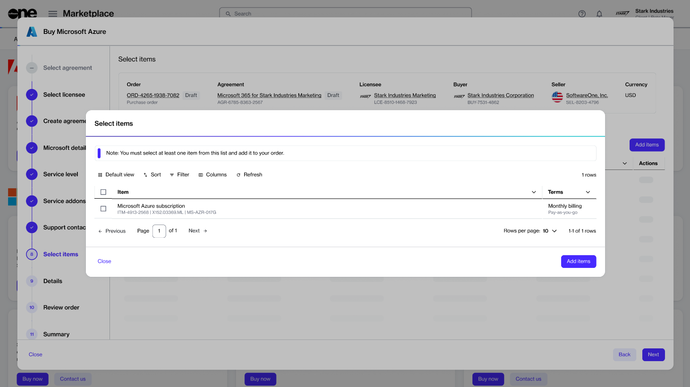

# Order Azure Subscription For New Tenant

This tutorial shows how to order a Microsoft Azure subscription by setting up a new agreement and a new Microsoft tenant.


Video tutorial: How to order Microsoft Azure subscription for a new Microsoft tenant


## Prerequisites

Before starting this tutorial, make sure you have the following:

* A licensee in the **active** state or permission to [create a new licensee](../../../modules-and-features/settings/licensees/create-licensees.md) (if you don't want to use an existing licensee). You'll need to select the licensee when setting up the new agreement.&#x20;
* Details, such as your company name, registration ID, and address. You'll need to provide these details when creating the new Microsoft tenant.
* Contact details of the person who will manage your account.&#x20;

## Ordering an Azure subscription for a new tenant 



**Start the purchase wizard for Azure**

To start the wizard:

1. Navigate to the **Products** page.&#x20;
2. Select **Microsoft Azure** from the available products.
3. On the details page, select **Buy now** to start the purchase wizard.

<figure><figcaption>
Buy now
</figcaption></figure>




**Follow the wizard to place the order**

Complete the following steps:

1. **Create agreement** - Choose **Create agreement** to start creating your new agreement.
2. **Select licensee** - Choose if you want to use an existing licensee or create a new one. In this tutorial, we'll select an existing licensee. You can add a new licensee by selecting **Add licensee**. See [Create Licensees](../../../modules-and-features/settings/licensees/create-licensees.md) for instructions.
3. **Create agreement** - Select **Create new cloud account** to create a new organization tenant with Microsoft. Then, select **Next**.
4. **Microsoft details** - Enter the details for your Microsoft account, then select **Next**:
   1. Enter the tenant name you want to use on the onmicrosoft.com domain. Make sure that the name doesn't include punctuation marks or spaces. You can check whether your tenant name is available using the [Access tenant name availability tool](https://onmicrosoft.platform.softwareone.com/).
   2. Select **Next**. The platform validates the details that you entered.
   3. Fill out the contact form. You'll need to provide the following details:
      1. Company name.
      2. Company registration ID or tax number.
      3. Company address, including city and zip/postal code.
      4. Contact details of the person who will manage your account.&#x20;
5. **Service level** - Select **Azure Essentials** or **Azure Advanced**, depending on the level of service you require for Microsoft Azure. Select **Next**.
6. **Service add-ons** - Review the add-ons offered as part of the Azure services. These are selected by default, and you can't change them. Select **Next**. &#x20;
7. **Support contacts** - Enter the contact details of your support administrator and choose your preferred support language. When done, select **Next**.
8. **Items** - Choose the Azure subscription and select **Add items** to add it to your order. Note that for Microsoft Azure, there is only one item, with no associated cost. When using Azure services, pay-as-you-go charges are generated against the subscription.

<figure><figcaption>
Select Items
</figcaption></figure>

9. **Details** - Provide reference details, like additional IDs or notes, and select **Next**.
10. **Review order** - Read the terms and conditions and the privacy statement. When done, select **Place order** to submit your order.
11. **Summary** - Select **View details** to go to the order details page. Otherwise, select **Close** to exit the wizard.



## Next steps

When your order has been placed, we verify the order details and create your new subscription. If there are issues with your order, the [order details ](https://docs.platform.softwareone.com/modules-and-features/marketplace/orders#subscription-details)page will provide information about the problem and any actions you may need to take.
