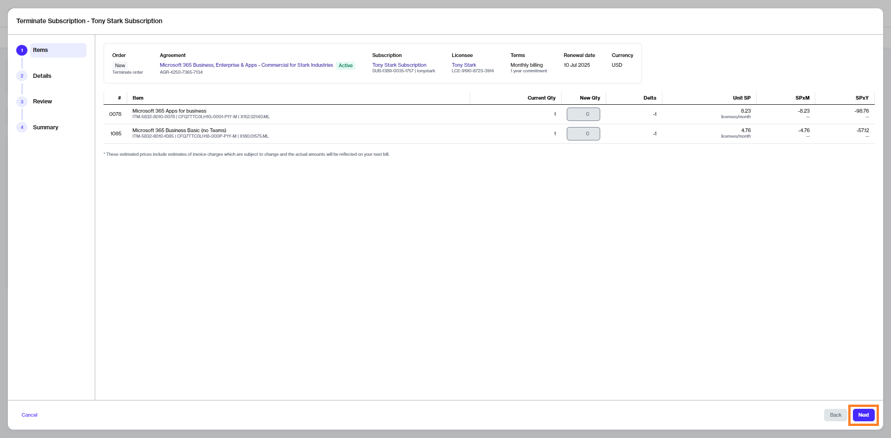

# Terminate Subscriptions

This tutorial shows how to cancel a Microsoft subscription by placing a termination order for the subscription.

## Prerequisites 

Before starting this tutorial, make sure that the subscription you want to terminate is active. You can check the subscription status on the **Subscriptions** page.

You must also be familiar with how to navigate the platform to view and manage your subscriptions.&#x20;

## 1. Open the subscription

1. Open the details page of the subscription you wish to terminate.
2. Click the chevron in the upper right and select **Terminate**.&#x20;

<figure><figcaption>
Terminate option
</figcaption></figure>

The **Terminate subscription** wizard starts and the **Items** step of the wizard is displayed.

## 2. Place the termination order

1. Review the details in the **Items** step to ensure that the quantity of the subscription you want to terminate is zero. Click **Next**.

<figure><figcaption>
Items
</figcaption></figure>

2. In the **Details** step, enter the reference information as needed and then click **Next**.&#x20;

<figure><figcaption>
Order details
</figcaption></figure>

3. In the **Review** step, click **Place Order** to place your termination order for the subscription.&#x20;

<figure><figcaption>
Review order
</figcaption></figure>

4. Click **View Order** to navigate to the order details page. Otherwise, click **Close** to close the **Summary** page.

## Next steps 

The termination order is submitted to the vendor for processing. You can view the latest status message on the details page of the termination order.
