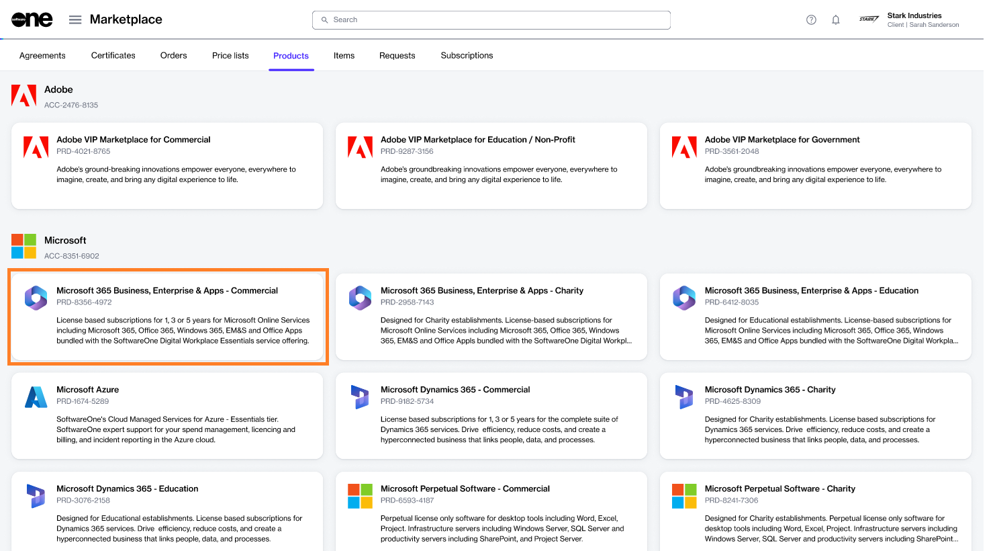
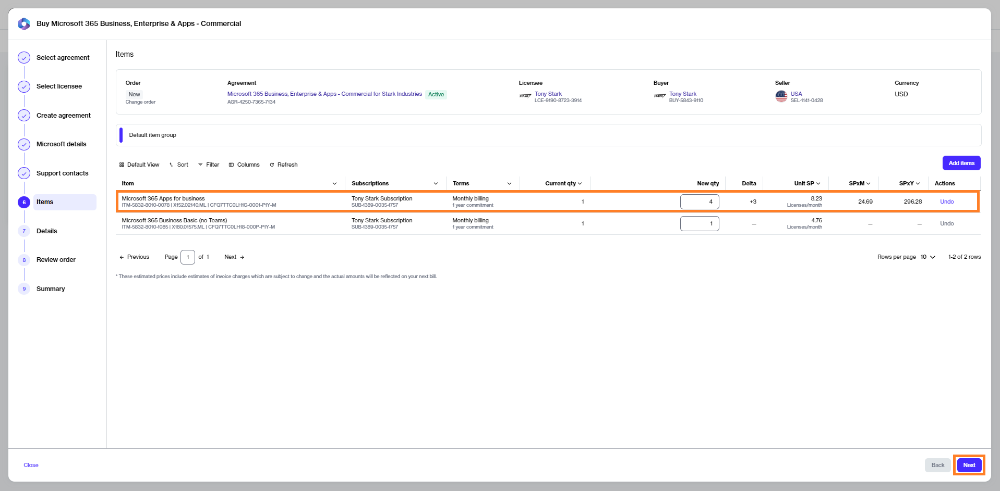
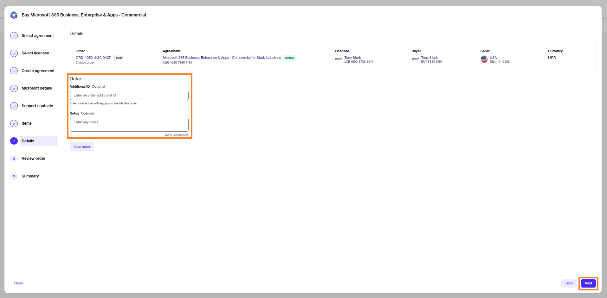
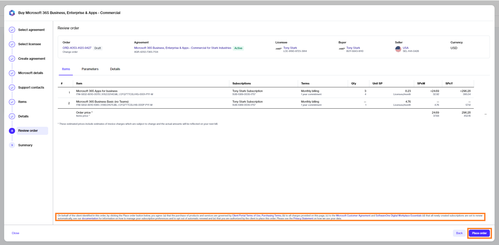

# Buy More Licenses for Microsoft 365 Subscription

If you already have an active agreement and want to buy more licenses for your 365 subscription under the same agreement, you can place a change order.&#x20;


Video tutorial: How to buy more licenses for your 365 subscription


## Prerequisites

Before starting this tutorial, make sure that the agreement you want to use is in the **Active** state.

## 1**.** Launch the purchase wizard 

1. Navigate to the **Products** page (**Marketplace** > **Products**) and select **Microsoft 365 Business, Enterprise & Apps - Commercial**.

<figure><figcaption>
Products page
</figcaption></figure>

2. Click **Buy now** on the details page.

<figure><figcaption>
Details page
</figcaption></figure>

## 2. Select agreement

Select an active agreement from the list of your agreements and click **Next**.&#x20;

<figure><figcaption>
Select agreement
</figcaption></figure>

You'll be directed to the **Items** section of the purchase wizard.

## 3. Buy more licenses 

To change the number of licenses, under **New qty**, enter the total number of licenses you want. For example, if you have 1 license and you want to add 3 more, enter the new quantity as 4.

Click **Next** to continue.&#x20;

<figure><figcaption>
Items 
</figcaption></figure>

## 4. Provide reference details

Enter additional details and click **Next**. It's optional to provide these details.

<figure><figcaption>
Order details
</figcaption></figure>

## 5. Place your order 

Review your order details and click **Place order** to complete the purchase.

<figure><figcaption>
Review order
</figcaption></figure>

## 6. View order summary 

1. Review your order summary and the latest status message.
2. Click **View Order** to navigate to the order details page. Otherwise, click **Close** to close the **Summary** page.
