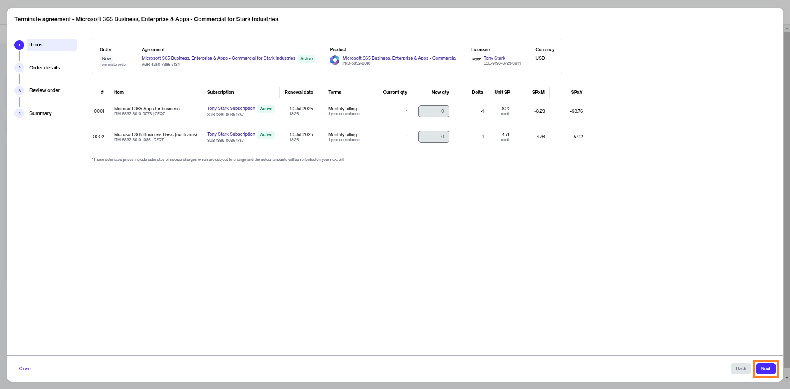

# Terminate All Microsoft Subscriptions

This tutorial shows how to cancel all Microsoft subscriptions in an agreement by placing a termination order for the agreement.

## Prerequisites 

Before starting this tutorial, make sure that the subscription you want to terminate is **active**. You can check the status on the **Subscriptions** page or by accessing the agreement.

## 1. Open the agreement

1. Navigate to the **Agreements** page (**Marketplace** > **Agreements**) and locate the agreement containing subscriptions you want to terminate.&#x20;
2. Click the agreement name. The following image shows an example agreement:

<figure><figcaption>
Agreements page
</figcaption></figure>

3. Click the chevron in the upper right on the details page and select **Terminate**.&#x20;

<figure><figcaption>
Terminate option
</figcaption></figure>

## 2. Terminate the agreement

1. Review the details to make sure that all subscriptions have zero quantity. Click **Next**.

<figure><figcaption>
Items
</figcaption></figure>

2. Enter the optional reference information as needed and click **Next**.&#x20;

<figure><figcaption>
Details
</figcaption></figure>

3. Click **Next** to place the termination order for your agreement.&#x20;

<figure><figcaption>
Review order
</figcaption></figure>

4. Click **View Order** to navigate to the order details page. Otherwise, click **Close** to close the **Summary** page.

## Next steps 

A termination order is created for the agreement and sent to the vendor for processing.

You can view the most up-to-date information for your order and its status on the [Order details](https://docs.platform.softwareone.com/platform-modules/marketplace/orders/orders-interface#subscription-details) page.&#x20;
