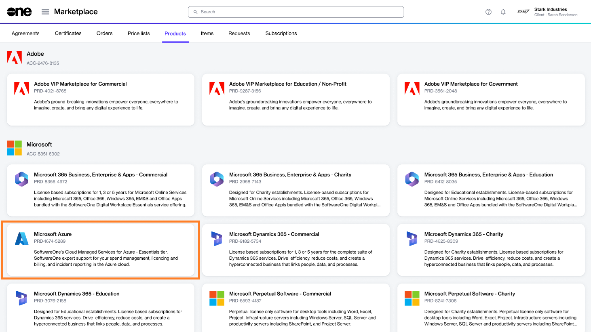
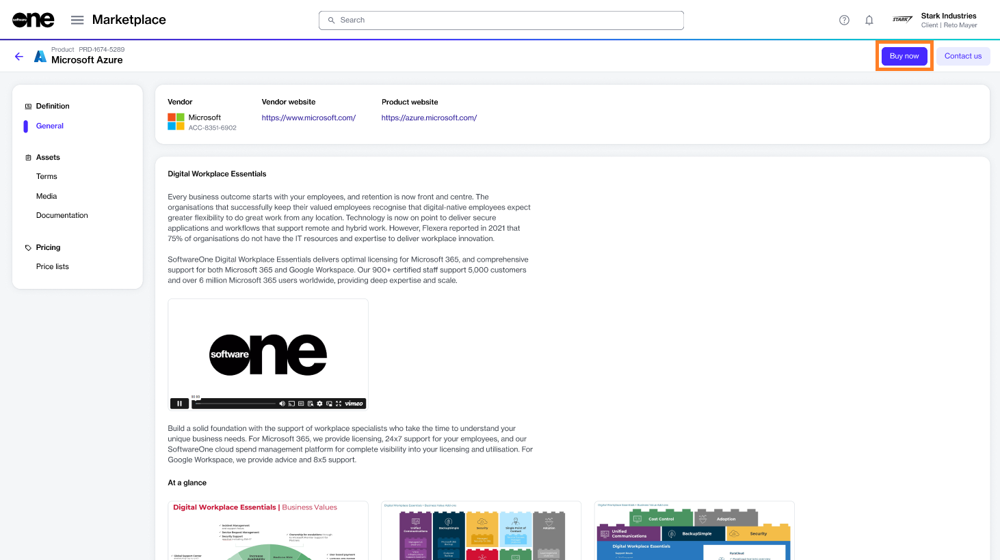

# Order Additional Microsoft Azure Subscriptions

If you already have an active agreement and want to order additional Azure subscriptions under the same agreement, you can place a change order.&#x20;

## Prerequisites

Before starting this tutorial, make sure that the agreement you want to use is in the **Active** state.

## 1**.** Launch the purchase wizard 

1. Navigate to the **Products** page (**Marketplace** > **Products**) and click **Microsoft Azure**.

<figure><figcaption>
Products page
</figcaption></figure>

2. Click **Buy now** on the details page.

<figure><figcaption>
Details page
</figcaption></figure>

The purchase wizard starts and the **Select agreement** section of the wizard is displayed.

## 2. Select agreement

Select an active agreement from the list of your agreements and click **Next**.&#x20;

<figure><figcaption>
Select agreement
</figcaption></figure>

You'll be directed to the **Select Items** section of the purchase wizard.

## 3. Add the Azure subscription

Click **Add items** to add the new Azure subscription to your order. Click **Next**.&#x20;

For Microsoft Azure, there is only one item, with no associated cost. When using Azure services, pay-as-you-go charges are generated against the subscription.

<figure><figcaption>
Select items
</figcaption></figure>

## 4. Provide reference details

Enter the reference information as needed and click **Next**.

<figure><figcaption>
Order details
</figcaption></figure>

## 5. Place your order

Review the details of your change order and click **Place order** to complete your purchase.

<figure><figcaption>
Review order
</figcaption></figure>

## 6. View order summary

1. Review your order summary and the latest status message.&#x20;
2. Click **View Order** to navigate to the order details page. Otherwise, click **Close** to close the **Summary** page.

<figure><figcaption>
Summary
</figcaption></figure>
