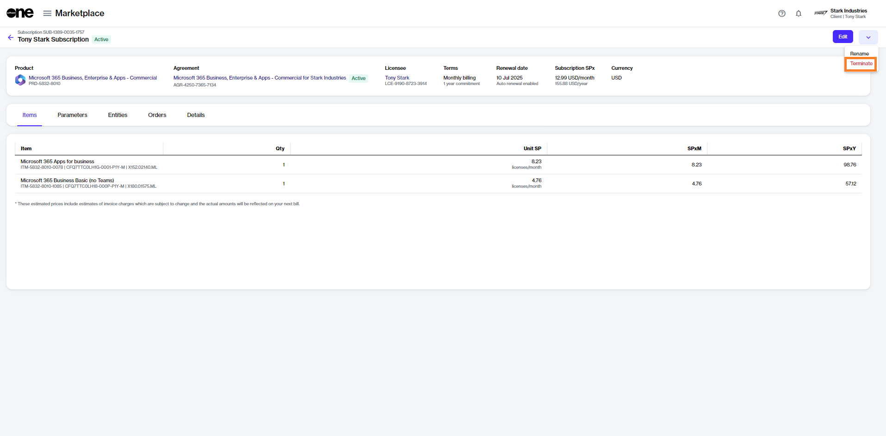

# Terminate Microsoft Subscription

This tutorial shows how to cancel a subscription within an agreement by placing a termination order for the subscription.

## Prerequisites 

Before starting this tutorial, make sure that the subscription you want to terminate is **active**. You can check the status on the **Subscriptions** page or by accessing the agreement.

## 1. Open the subscription

1. Navigate to the **Subscriptions** page (**Marketplace** > **Subscriptions**) and click the subscription to terminate. Make sure that the subscription is **Active**.

<figure><figcaption>
Subscriptions page
</figcaption></figure>

2. Click the chevron in the upper right on the details page and select **Terminate**.&#x20;

<figure><figcaption>
Terminate option
</figcaption></figure>

The **Terminate subscription** wizard launches.

## 2. Place the termination order

1. Review the details to make sure that the quantity of the subscription you want to terminate is zero. Click **Next**.

<figure><figcaption>
Items
</figcaption></figure>

2. Enter the reference information as needed and then click **Next**.&#x20;

<figure><figcaption>
Order details
</figcaption></figure>

3. Click **Place Order** to place your termination order.&#x20;

<figure><figcaption>
Review order
</figcaption></figure>

4. Click **View Order** to navigate to the order details page. Otherwise, click **Close** to close the **Summary** page.

## Next steps 

The termination order is submitted to the vendor for processing.

You can view the most up-to-date information about your order and its status on the [Order details](https://docs.platform.softwareone.com/platform-modules/marketplace/orders/orders-interface#subscription-details) page.&#x20;
