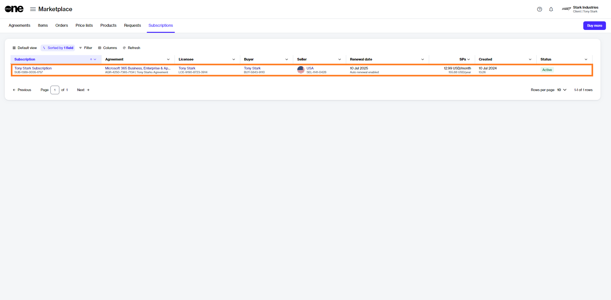
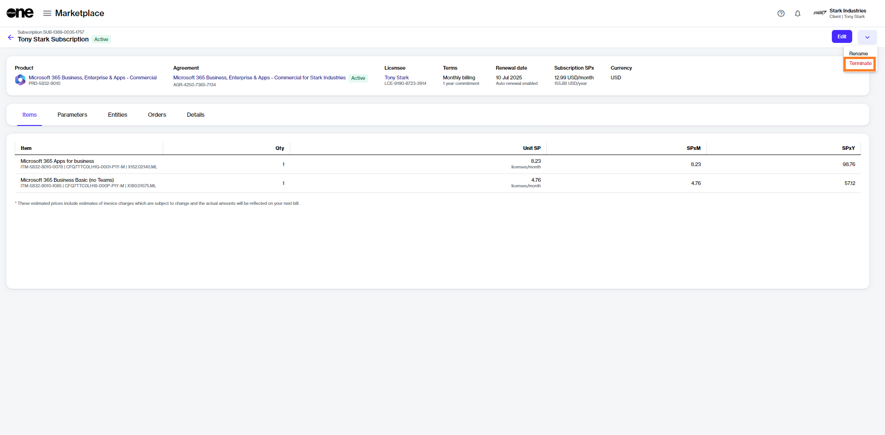
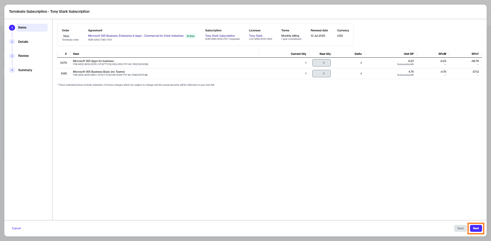
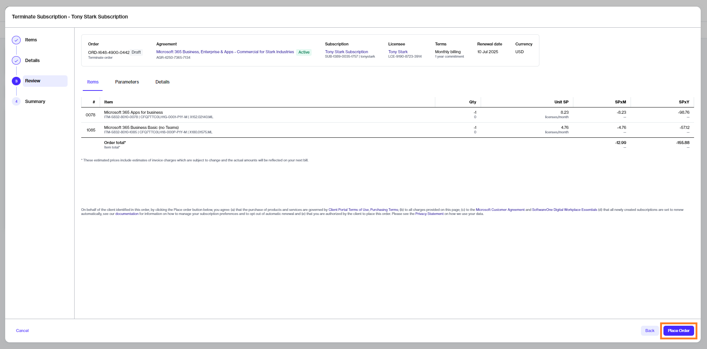
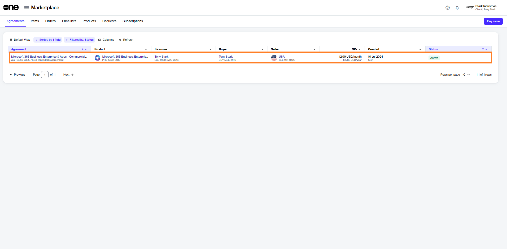
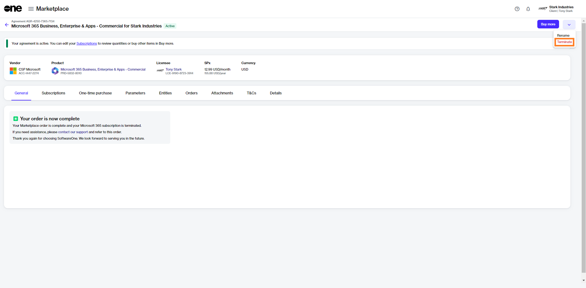
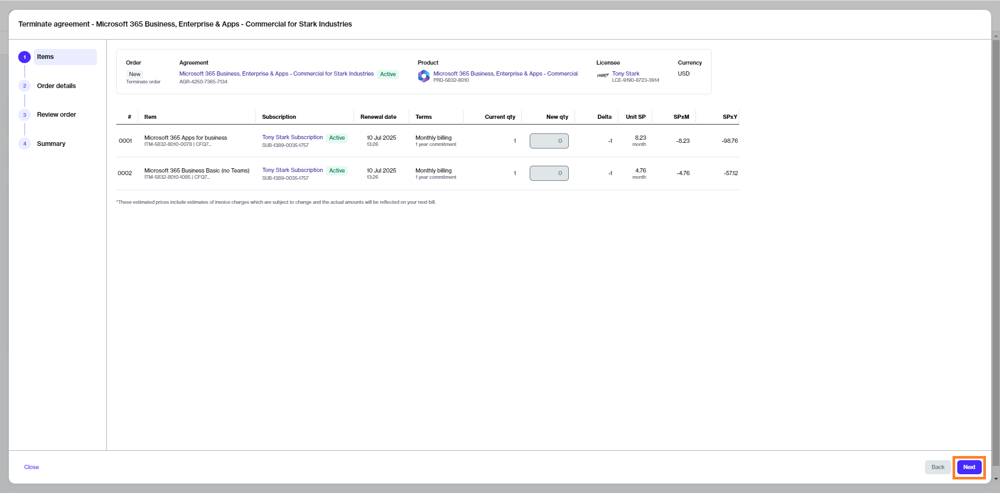
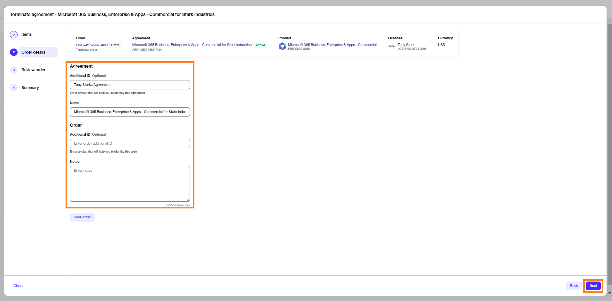

# Terminate Microsoft Subscriptions

If you want to cancel your Microsoft subscription, you'll need to create a termination order.&#x20;

Placing a termination order suspends the subscription until it reaches the end date when it'll be terminated. A suspended subscription cannot be used, but will still be billed until the end date.&#x20;

The following specifics apply to Microsoft subscriptions:

* For Microsoft Azure, you can cancel a single subscription or the entire agreement containing subscriptions. Additionally, for Microsoft Azure, the usage is billed in arrears. It means you'll be billed as per your usage in the previous month.
* For all other Microsoft products, such as Microsoft Dynamics and Microsoft 365, you can terminate or reduce the quantity within 7 days from your date of purchase.
* Although Microsoft supports co-terming, the Marketplace Platform doesn't support co-terming for Microsoft products.

## Terminate a subscription

If you have several Microsoft subscriptions in an agreement and want to cancel a subscription within that agreement, follow the steps in this section.&#x20;

### 1. Open the subscription

1. Navigate to the **Subscriptions** page (**Marketplace** > **Subscriptions**) and click the subscription to terminate. Make sure that the subscription is **Active**.

<figure><figcaption>
Subscriptions page
</figcaption></figure>

2. Click the chevron in the upper right on the details page and select **Terminate**.&#x20;

<figure><figcaption>
Terminate option
</figcaption></figure>

The **Terminate subscription** wizard launches.

### 2. Place the termination order

1. Review the details to make sure that the quantity of the subscription you want to terminate is zero. Click **Next**.

<figure><figcaption>
Items
</figcaption></figure>

2. Enter the reference information as needed and then click **Next**.&#x20;

<figure><figcaption>
Order details
</figcaption></figure>

3. Click **Place Order** to place your termination order.&#x20;

<figure><figcaption>
Review order
</figcaption></figure>

4. Click **View Order** to navigate to the order details page. Otherwise, click **Close** to close the **Summary** page.

## Terminate all subscriptions

### 1. Open the agreement

1. Navigate to the **Agreements** page (**Marketplace** > **Agreements**) and locate the agreement containing subscriptions you want to terminate.&#x20;
2. Click the agreement name. The following image shows an example agreement:

<figure><figcaption>
Agreements page
</figcaption></figure>

3. Click the chevron in the upper right on the details page and select **Terminate**.&#x20;

<figure><figcaption>
Terminate option
</figcaption></figure>

### 2. Terminate the agreement

1. Review the details to make sure that all subscriptions have zero quantity. Click **Next**.

<figure><figcaption>
Items
</figcaption></figure>

2. Enter the optional reference information as needed and click **Next**.&#x20;

<figure><figcaption>
Details
</figcaption></figure>

3. Click **Next** to place the termination order for your agreement.&#x20;

<figure><figcaption>
Review order
</figcaption></figure>

4. Click **View Order** to navigate to the order details page. Otherwise, click **Close** to close the **Summary** page.

### Next steps 

Your termination order is submitted to the vendor for processing.

You can view the most up-to-date information on your order and its status on the [Order details](https://docs.platform.softwareone.com/platform-modules/marketplace/orders/orders-interface#subscription-details) page.&#x20;
