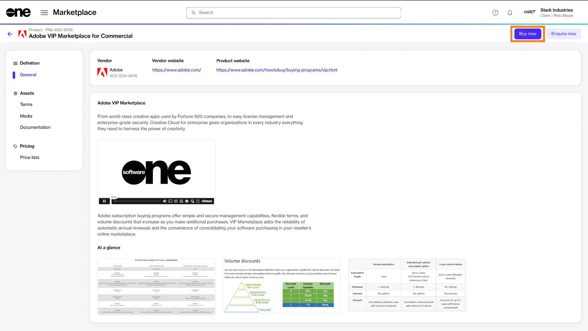
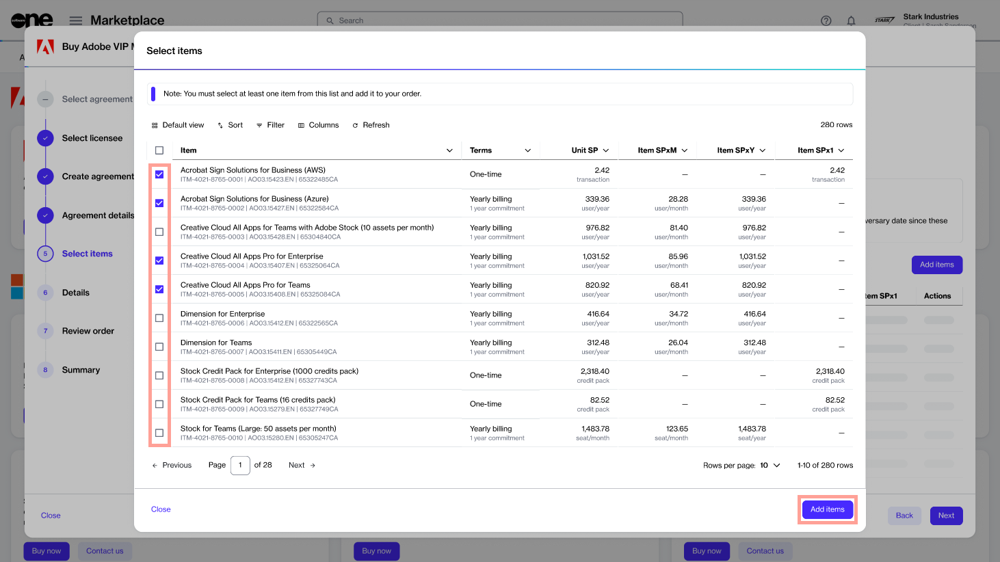
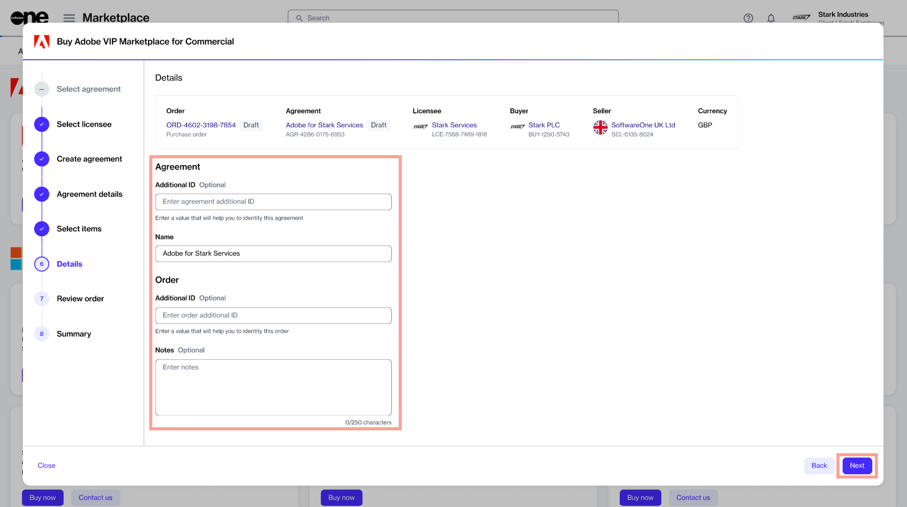

# Order Adobe Subscription

Buying from the Adobe VIP Marketplace buying program means purchasing subscription-based products. You subscribe to these products and pay periodically for their usage.&#x20;

To order a subscription, you must have an agreement. An agreement is a contractual relationship between a seller, buyer, and licensee. Therefore, each ordered subscription is part of an agreement.&#x20;

When you place an order, it either involves setting up a new agreement or adding to an existing agreement.&#x20;

This tutorial shows how to order new Adobe subscriptions by setting up a new agreement and a new Adobe VIP Marketplace account.

## Prerequisites

Before you begin, ensure you have the following:

* An account on the Marketplace Platform.
* Your company address and contact. You'll need to provide this information when creating your Adobe VIP Marketplace account.&#x20;
* A licensee in the **active** state or permission to [create a new licensee](../../../platform-modules/settings/licensees/create-licensees.md) (if you don't want to use an existing licensee). You'll need to select the licensee when creating the new agreement.&#x20;

## 1. Launch the Purchase wizard

1. Navigate to the **Products** page (**Marketplace** > **Products**) and click **Adobe VIP Marketplace for Commercial**.

<figure><figcaption>
Products page
</figcaption></figure>

2. Click **Buy now** on the details page.

<figure><figcaption>
Details page
</figcaption></figure>

The purchase wizard starts and the **Select agreement** section displays.

## 2. Create agreement

Click **Create agreement** to start creating your new Adobe agreement.&#x20;

<figure><figcaption>
Create agreement
</figcaption></figure>

## 3. Select licensee

1. Choose the licensee you want to use. A licensee is the end-user entity of the product being purchased. In this tutorial, we'll select an existing licensee, as shown in the following image. You can also add a new licensee by clicking **Add licensee** and following the instructions in [Create Licensees](../../../platform-modules/settings/licensees/create-licensees.md).
2. Click **Next**.&#x20;

<figure><figcaption>
Select licensee
</figcaption></figure>

## 4. Choose your account

1. Choose whether to create a new account with Adobe or use your existing account. In this tutorial, we'll create a new account by selecting **Create account**, as shown in the following image.&#x20;
2. Click **Next**.

<figure><figcaption>
Create account
</figcaption></figure>

Note that if you want to migrate your existing Adobe VIP account to Adobe VIP Marketplace, select **Migrate account**. If you choose this option, you'll only need to enter your Adobe membership ID in the next step.

## 5. Provide agreement details

Fill out the contact form containing the following fields and click **Next**:

<figure><figcaption>
Agreement details
</figcaption></figure>

* **Company Name** - Enter your company name in this field.&#x20;
* **Address** - Provide your address, including city, state, and zip/postal code.&#x20;
* **Contact** - Provide your contact details.
* **3-year commitment -** Select to apply to a 3-year commitment. For more information, see [3-year commit subscription](https://helpx.adobe.com/uk/enterprise/vip/vip-subscription-term-options-marketplace.html).
* **Minimum licenses -** Enter the minimum number of licenses to commit to.
* **Minimum consumables** - Enter the minimum number of consumables to commit to.

If you are migrating your account, enter your Adobe membership ID.&#x20;

<figure><figcaption>
Membership ID
</figcaption></figure>

## 6. Choose items

1. Choose the Adobe items you want and click **Add items** to add those items to your order. You can select multiple items, as shown in the following image.
2. Click **Next**.

<figure><figcaption>
Select items
</figcaption></figure>

## 7. Provide agreement and order details

1. (Optional) Add your order and agreement details as necessary so you can identify them easily.&#x20;
2. Click **Next**.

<figure><figcaption>
Details
</figcaption></figure>

## 8. Place your order

1. Review the details of your order and make sure to read all terms and conditions, including the privacy statement. By placing the order, you accept all terms.
2. Click **Place order** to complete your purchase.

<figure><figcaption>
Review order section
</figcaption></figure>

## 9. View order summary

1. View your order summary and the latest status message.&#x20;
2. Click **View Order** to navigate to the order details page. Otherwise, click **Close** to close the **Summary** page.

<figure><figcaption>
Order summary
</figcaption></figure>

## Next steps

After placing the order, you'll receive an invitation from Adobe to accept the terms and conditions for Adobe VIP Marketplace.&#x20;

After you’ve accepted the terms and conditions, you’ll be able to manage your licenses and begin deploying them to users immediately in [Adobe Admin Console](https://adminconsole.adobe.com/).
