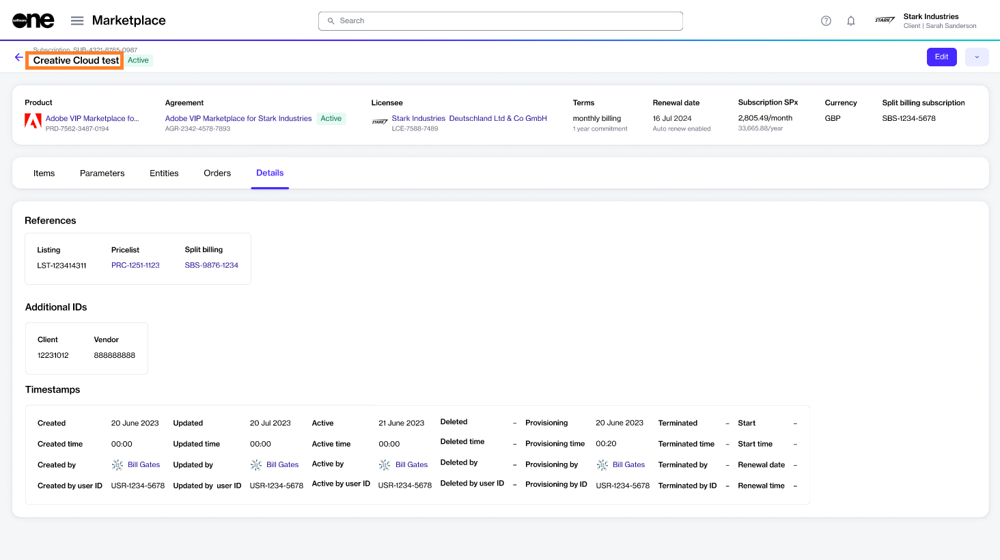

# Renaming Adobe Subscriptions

Your account on the Marketplace Platform might have several Adobe subscriptions. You can rename your subscriptions so you can identify and locate them easily. This tutorial shows how you can do so.

## Prerequisites

Make sure that the subscription you want to rename is **active** or **updating**. Terminated subscriptions cannot be renamed.

## 1. Open the subscription 

1. Navigate to the **Subscriptions** page (**Marketplace** > **Subscriptions**).&#x20;
2. Click the subscription you want to rename. The following image shows an example subscription called **Creative Cloud All Apps Pro for Enterprise**.

<figure><figcaption>
Subscriptions page
</figcaption></figure>

## 2. Provide the new name 

1. Click the chevron in the upper right of the details page and select **Rename**.

<figure><figcaption>
Rename option on the details page
</figcaption></figure>

2. Enter the new name in the **Subscription name** field and save your changes. In this example, the name is changed to **Creative Cloud test**, as shown in the following image:

<figure><figcaption>
Subscription name
</figcaption></figure>

The subscription is updated immediately and the new name is reflected on the **Details** tab of your subscription:

<figure><figcaption>
Details tab
</figcaption></figure>
