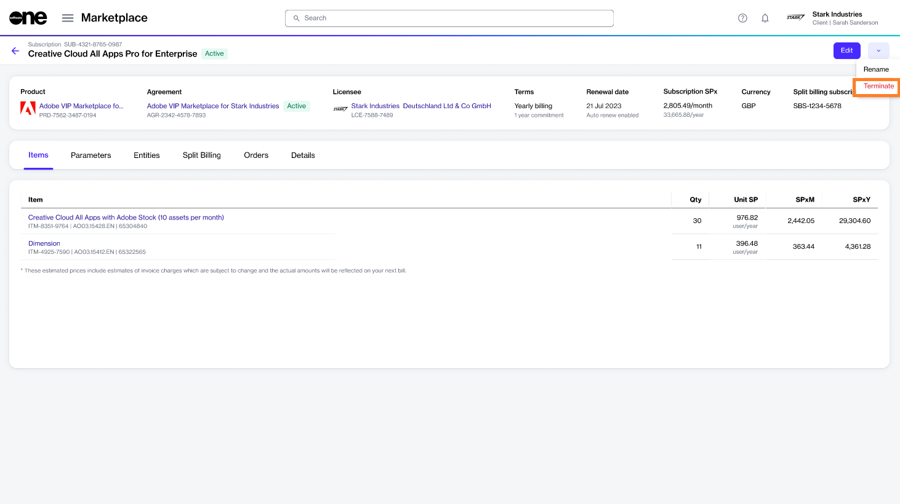
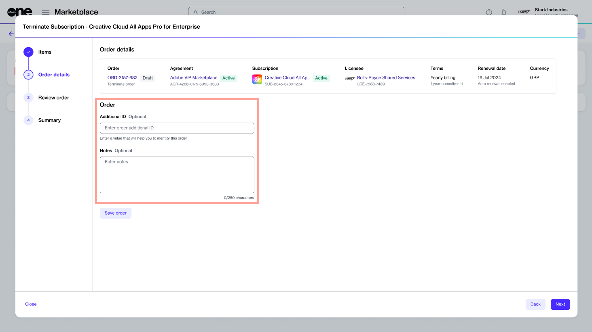

# Terminate Adobe Subscription

If you want to cancel your Adobe subscriptions within the 14-day return period or if you are outside the 14-day return period and don't want your subscription to auto-renew on the renewal date, you'll need to create a termination order.&#x20;

Adobe subscriptions can be terminated both within and outside the 14-day return period. To learn about the cancellation policies, see [What happens if I terminate my Adobe subscription?](../../../help-and-support/frequently-asked-questions/what-happens-if-i-terminate-my-adobe-subscription.md)

## Prerequisites 

Make sure that the subscription you want to terminate is **active**. You can check the status on the **Subscriptions** page or by accessing the agreement.

## 1. Open the subscription

1. Navigate to the **Subscriptions** page (**Marketplace** > **Subscriptions**) and click the subscription to terminate. The following image shows an example:

<figure><figcaption>
Subscriptions page
</figcaption></figure>

2. Click the chevron in the upper right on the details page and select **Terminate**.

<figure><figcaption>
Terminate option on the details page
</figcaption></figure>

&#x20;The **Terminate subscription** wizard launches.

## 2. Place the termination order

1. Review the details to make sure that the quantity of the subscription you want to terminate is zero. Click **Next**.&#x20;

<figure><figcaption>
Items
</figcaption></figure>

2. Enter the reference information as needed and click **Next**. You can use the fields to add details that might help you identify the order easily.

<figure><figcaption>
Order details
</figcaption></figure>

3. Click **Place Order** to place your termination order.&#x20;

<figure><figcaption>
Review order
</figcaption></figure>

4. Click **View Order** to navigate to the order details page. Otherwise, click **Close** to close the **Summary** page.

## Next steps

Your termination order is submitted to the vendor for processing.&#x20;

You can view the most up-to-date information on your order and its status on the [Order details](../../../platform-modules/marketplace/orders/orders-interface.md#subscription-details) page.
