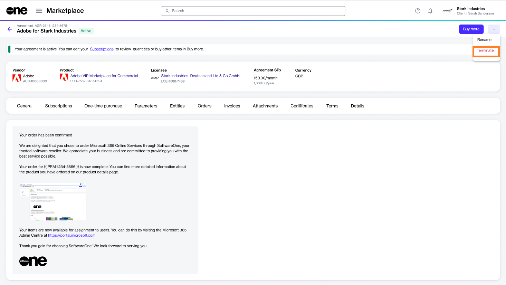
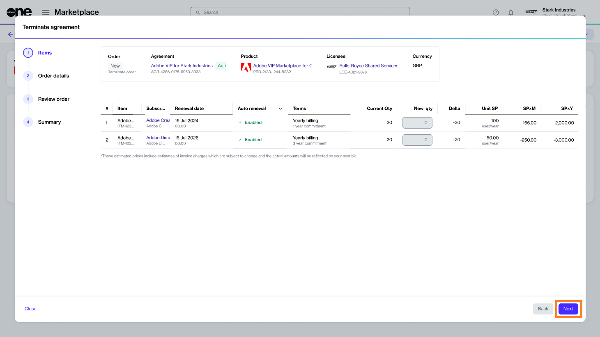
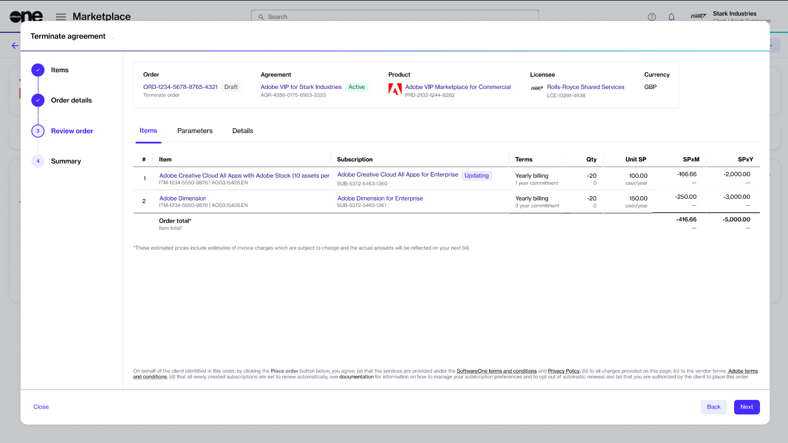

# Terminate All Adobe Subscriptions

The only way to terminate all Adobe subscriptions in an agreement is by terminating the agreement altogether. This tutorial shows how to create a termination order for an existing Adobe agreement.

Adobe subscriptions can be terminated both within and outside the 14-day return period. To learn about the cancellation policies, see [What happens if I cancel my Adobe subscription?](../../../help-and-support/frequently-asked-questions/what-happens-if-i-cancel-my-adobe-subscription.md)

## Prerequisites

Make sure that the agreement you want to terminate is **Active**. Agreements in any other state cannot be terminated.

## 1. Open the agreement

1. Navigate to the **Agreements** page (**Marketplace** > **Agreements**) and locate the agreement containing subscriptions you want to terminate.&#x20;
2. Click the agreement name. The following image shows an example agreement:

<figure><figcaption>
Agreements page
</figcaption></figure>

3. Click the chevron in the upper right on the details page and select **Terminate**.&#x20;

<figure><figcaption>
Details page
</figcaption></figure>

## 2. Place the termination order

1. Review the details to make sure that the **New qty** field is set to 0 (zero). Click **Next**.

<figure><figcaption>
Items 
</figcaption></figure>

2. Enter the reference information as needed and click **Next** to continue. Note that it's optional to enter these fields.

<figure><figcaption>
Order details
</figcaption></figure>

3. Click **Next** to place the termination order for your agreement.&#x20;

<figure><figcaption>
Review order
</figcaption></figure>

4. Click **View Order** to navigate to the order details page. Otherwise, click **Close** to close the **Summary** page.

<figure><figcaption>
Order summary
</figcaption></figure>

## Next steps

Your termination order is submitted to the vendor for processing.

You can view the most up-to-date information on your order and its status on the [Order details](../../../platform-modules/marketplace/orders/orders-interface.md#subscription-details) page.
