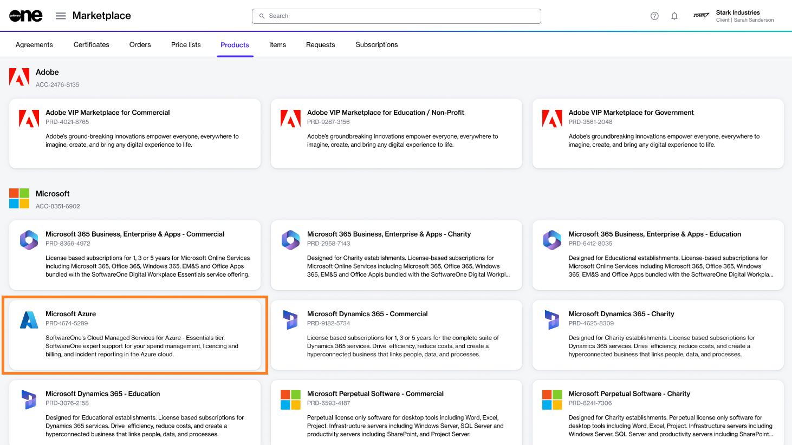

# Buying Microsoft Azure (Existing Agreement)

In this tutorial, you'll learn how to order a Microsoft Azure subscription if you already have an agreement with SoftwareOne.

## 1**.** Launch the Purchase Wizard

**To launch the purchase wizard**

1. Sign in to your account and navigate to the **Products** page.
2. Click **Microsoft Azure** in the list of products.&#x20;

<figure><figcaption></figcaption></figure>

3. Click **Buy now**.

<figure><figcaption></figcaption></figure>

The purchase wizard starts and the **Select agreement** section of the wizard is displayed.

<figure><figcaption>
Purchase Wizard
</figcaption></figure>

## 2. Select agreement

Select an active agreement from the list of your agreements and click **Next** to continue.

<figure><figcaption>
Select agreement
</figcaption></figure>

## 3. Add items to your order

Add new items to your order and review prices for each item.

## 4. (Optional) Provide additional IDs and notes

Add a reference number and your order notes. Then, click **Next** to continue.

<figure><figcaption>
Order details
</figcaption></figure>

## 5. Review and place your order

Review your order details and click **Place order**.

<figure><figcaption>
Review order
</figcaption></figure>

## 6. Review the summary

Review the summary and then click **Close** to exit the wizard or click **View order** to go to the details page of your order.&#x20;

<figure><figcaption>
Summary section
</figcaption></figure>
