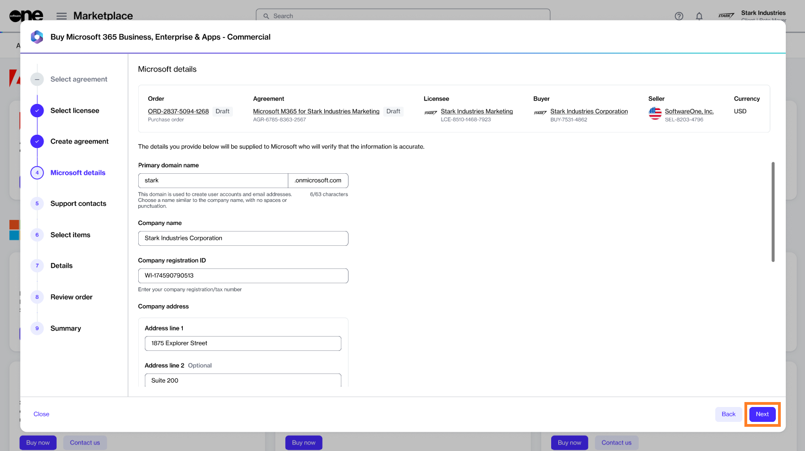
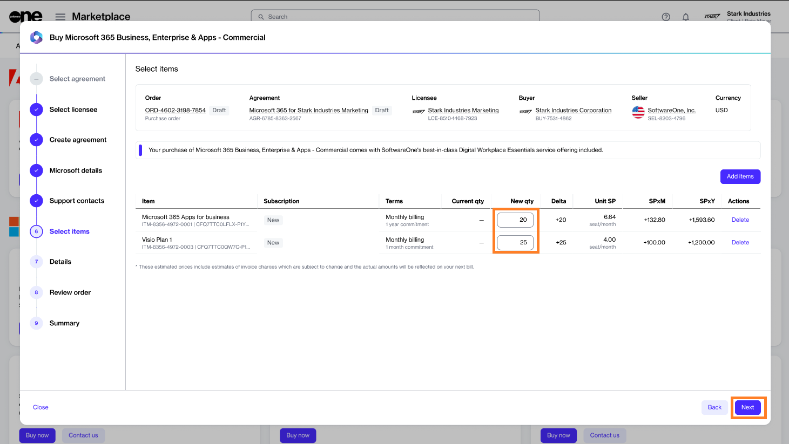
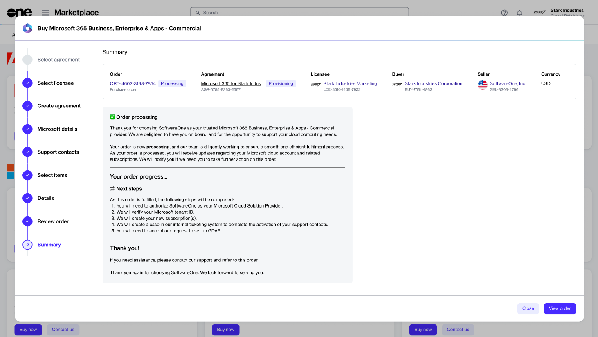

# Order Microsoft 365 Subscription (New Tenant)

This tutorial shows how to order a Microsoft 365 subscription by setting up a new agreement and a new Microsoft tenant.


Video tutorial: How to order Microsoft 365 subscription for a new tenant


## Prerequisites 

Before starting this tutorial, make sure you have the following:

* A licensee in the **active** state or permission to [create a new licensee](../../../platform-modules/settings/licensees/create-licensees.md) (if you don't want to use an existing licensee). You'll need to select the licensee when setting up the new agreement.&#x20;
* Details, such as your company name, registration ID, and address. You'll need to provide these details while creating your new Microsoft tenant.&#x20;
* The contact details of the person who will manage your account.&#x20;

## 1. Select the product

1. Navigate to the **Products** page (**Marketplace** > **Products**) and select **Microsoft 365 Business, Enterprise & Apps - Commercial**.

<figure><figcaption>
Products page
</figcaption></figure>

2. Click **Buy now** on the details page.

<figure><figcaption>
Details page
</figcaption></figure>

The purchase wizard starts and the **Select agreement** section displays.

## 2. Create agreement

Click **Create agreement** to set up your new agreement.

<figure><figcaption>
Select agreement
</figcaption></figure>

## 3. Select licensee

1. Choose the licensee you want to use. In this tutorial, we'll select an existing licensee, as shown in the following image. However, you can add a new licensee by clicking **Add licensee** and following the instructions in [Create Licensees](../../../platform-modules/settings/licensees/create-licensees.md).
2. Click **Next**.&#x20;

<figure><figcaption>
Select licensee
</figcaption></figure>

## 4. Create your tenant

Select **Create new cloud account** to create a new Microsoft tenant and click **Next** to continue.

<figure><figcaption>
Create new tenant
</figcaption></figure>

## 5. Provide Microsoft details

1. (Optional) Click **Access tenant name availability tool** to check if the tenant name is available.&#x20;
2. After checking the availability, provide the name you want to use on the onmicrosoft.com domain. Make sure to enter the name without dots or spaces. Click **Next** to continue.&#x20;

<figure><figcaption>
Microsoft details
</figcaption></figure>

3. Provide the following information and click **Next:**
   * Company name.
   * Company registration ID or tax number.
   * Company address, including city and zip/postal code.
   * Contact details of the person who will manage your account.&#x20;


These fields are enabled only after the platform validates your Microsoft tenant.


<figure><figcaption>
Microsoft details
</figcaption></figure>

## 6. Add support contacts

1. Enter the contact you want to use for support and your preferred support language. The contact details are populated from the **Licensee** information, but you can change the details if required.&#x20;
2. Click **Next**.&#x20;

<figure><figcaption>
Support contacts
</figcaption></figure>

## 7. Select items

1. Choose the required items and click **Add items** to add those items to your order. You can select multiple items, as shown in the following image.

<figure><figcaption>
Select items
</figcaption></figure>

2. After adding the new items, adjust the quantity as needed in the **New Qty** field and click **Next**.

<figure><figcaption>
Add items
</figcaption></figure>

## 8. Provide agreement and order details

1. (Optional) Add your order and agreement details as necessary so you can identify these easily.&#x20;
2. Click **Next**.

<figure><figcaption>
Details
</figcaption></figure>

## 9. Place your order

1. Review the details of your order and make sure to read all terms and conditions, including the privacy statement. By placing the order, you accept all terms.
2. Click **Place order** to complete your purchase.

<figure><figcaption>
Review order
</figcaption></figure>

## 10. View order summary

1. Review your order summary and the latest status message.&#x20;
2. Click **View Order** to navigate to the order details page. Otherwise, click **Close** to close the **Summary** page.

<figure><figcaption>
Summary
</figcaption></figure>

## Next steps

After your order is submitted for processing, we'll confirm your Microsoft tenant and create your new subscription.&#x20;
