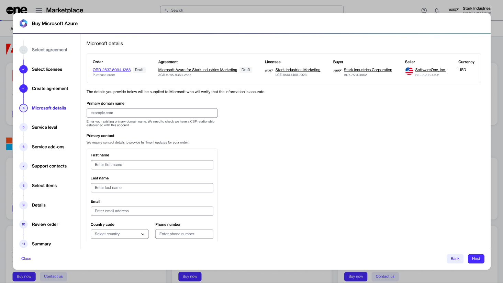
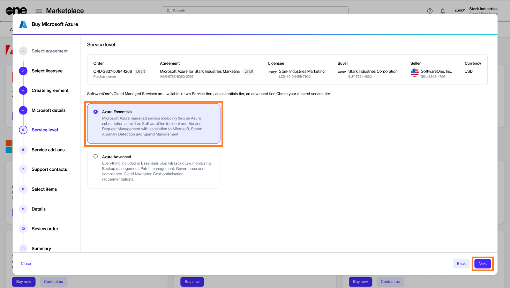
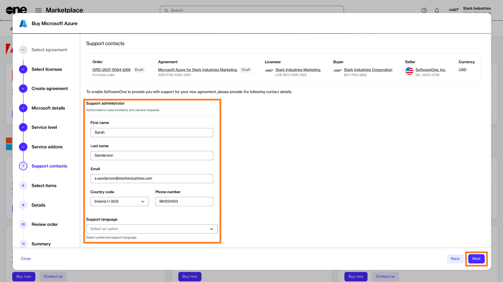
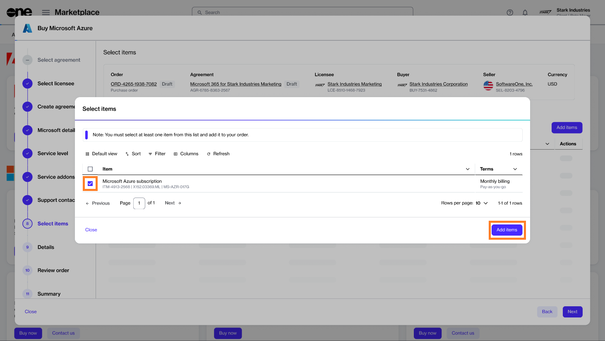
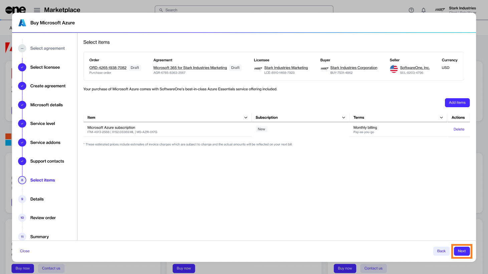
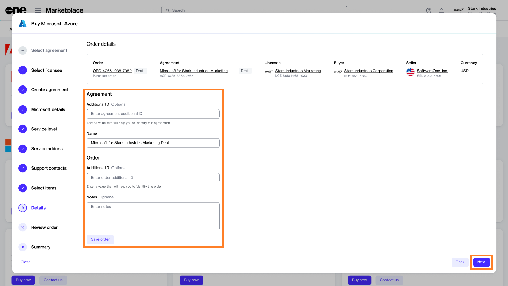
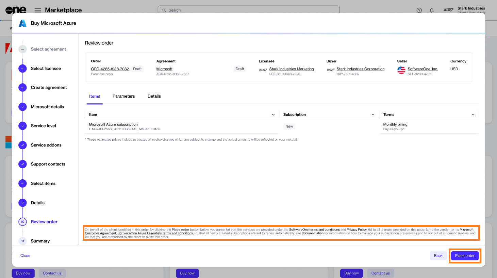
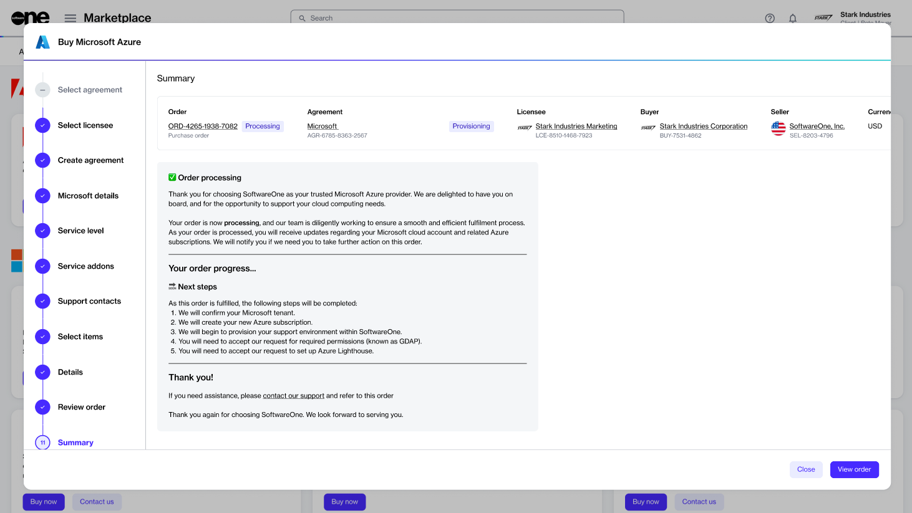

# Ordering Microsoft Azure (Existing Tenant)

This tutorial shows how to order a Microsoft Azure subscription by setting up a **new agreement** and connecting your **existing Microsoft tenant**.&#x20;

## Prerequisites 

Before you begin, ensure you have the following:

* A licensee in the **active** state or permission to [create a new licensee](../../../platform-modules/settings/licensees/create-licensees.md) (if you don't want to use an existing licensee). You'll need to select the licensee when setting up the new agreement.&#x20;
* Your Microsoft tenant name.&#x20;
* Contact details of the person who will manage your account.&#x20;

## 1**.** Launch the Purchase wizard

1. Navigate to the **Products** page and click **Microsoft Azure**.&#x20;

<figure><figcaption>
Products page
</figcaption></figure>

2. Click **Buy now** on the details page.

<figure><figcaption>
Details page
</figcaption></figure>

The purchase wizard starts and the **Select agreement** section of the wizard is displayed.

## 2. Create agreement

Click **Create new agreement** to set up your new agreement.

<figure><figcaption>
Select agreement
</figcaption></figure>

## 3. Select licensee

1. Choose the licensee you want to use. In this tutorial, we'll select an existing licensee, as shown in the following image. However, you can add a new licensee by clicking **Add licensee** and following the instructions in [Create Licensees](../../../platform-modules/settings/licensees/create-licensees.md).
2. Click **Next**.&#x20;

<figure><figcaption>
Select licensee
</figcaption></figure>

## 4. **Choose the Microsoft** tenant

1. Choose whether you want to create a new Microsoft account or use your existing account. In this tutorial, we'll select **Connect existing cloud account**, as shown in the following image.
2. Click **Next**.

<figure><figcaption>
Create agreement
</figcaption></figure>

## 5. Specify the domain

1. (Optional) Click **Access tenant name availability tool** to check the availability of tenant names from Microsoft.
2. Enter your preferred domain name (also known as tenant name) in the **Primary** **domain name** field.&#x20;
3. Fill out the required fields and click **Next**.

<figure><figcaption></figcaption></figure>

## 6. Choose the service level

1. Select **Azure Essentials** or **Azure Advanced**, depending on the level of service you require for Azure. In this tutorial, we'll select **Azure Essentials**, as shown in the following image.
2. Click **Next to continue.**

<figure><figcaption>
Service level
</figcaption></figure>

## 7. Review add-ons

1. When you select **Azure Essentials** or **Azure Advanced**, all add-ons offered as part of the Azure services are displayed. All service add-ons are selected by default and you cannot change them.
2. Click **Next**.

<figure><figcaption>
Add-ons
</figcaption></figure>

## 8. Add support contacts

1. Enter the contact you want to use for support and your preferred support language.&#x20;
2. Click **Next** to continue.

<figure><figcaption>
Support contacts
</figcaption></figure>

## 9. Select items

1. Select the Azure subscription item and click **Add items** to add it to your order. Note that for Microsoft Azure, there is only one item, with no associated cost. When using Azure services, pay-as-you-go charges are generated against the subscription.

<figure><figcaption>
Select items
</figcaption></figure>

2. Click **Next** to continue.

<figure><figcaption>
Select items
</figcaption></figure>

## 10. Add reference details

Enter the reference information as needed and click **Next**.

<figure><figcaption></figcaption></figure>

## 11. Place your order

1. Review the details of your order and make sure to read the terms using the links in the footer.&#x20;
2. Click **Place order** to complete your purchase.

<figure><figcaption>
Place order
</figcaption></figure>

## 12. View order summary

1. Review your order summary and the latest status message.
2. Click **View Order** to navigate to the order details page. Otherwise, click **Close** to close the **Summary** page.

<figure><figcaption>
Summary
</figcaption></figure>

## Next steps

<mark style="background-color:red;">**\[Information needed]**</mark>
