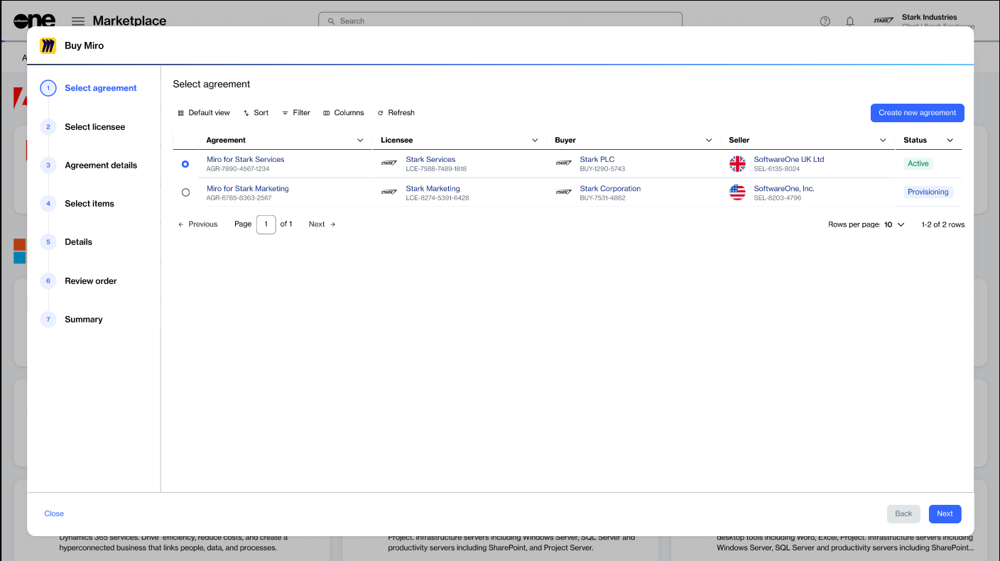
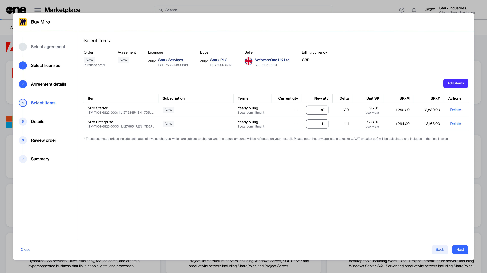
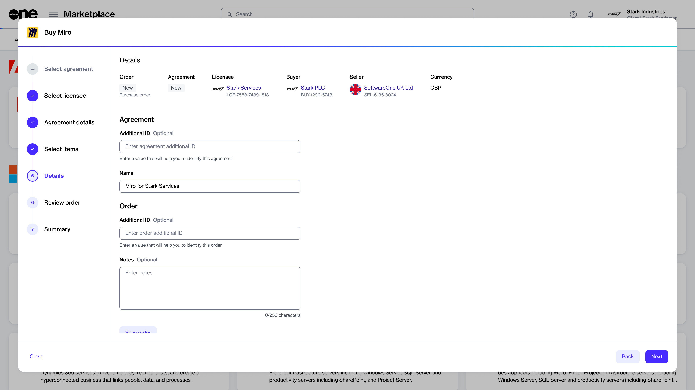
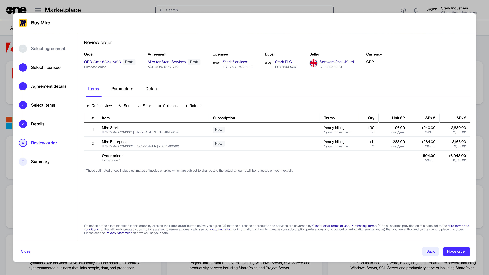
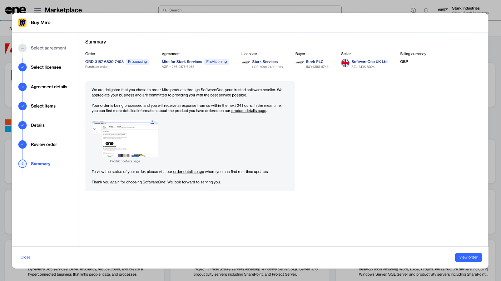

# How does the Marketplace purchase wizard work?

The SoftwareOne Marketplace's purchase wizard simplifies the ordering process by guiding you through each necessary step of placing an order.&#x20;

There are two ways to launch the wizard, depending on whether you are creating a purchase or a change order. You can either start the wizard by selecting a product on the **Products** page or by selecting **Buy more** on the **agreement details** page.

<figure><figcaption>
Use the Purchase Wizard to place an order.
</figcaption></figure>

### Layout and navigation

The wizard contains a vertical progress bar with step numbers and a title, data grid, and navigation buttons:

* The progress bar shows how far you have progressed and how many steps remain before the order can be placed. The steps are defined by vendors and vary based on the product. You cannot use step numbers to navigate between different pages of the wizard.&#x20;
* The [data grid](../../marketplace-platform/getting-started/interface/customize-the-data-grid.md) is where the main content is displayed. This is where you can select your purchasing options, choose items you want to order, [view description cards](../../marketplace-platform/getting-started/interface/view-information-cards.md#description-cards) containing information about item prices, enter your details, and more.&#x20;
* The **Close**, **Back**, and **Next** buttons allow you to navigate between pages or close the wizard. Some buttons might be unavailable depending on your current step in the wizard.&#x20;

### Guided steps

The purchase guide contains a series of guided steps. Some steps are common and apply to each vendor and product, and some are dynamic, vendor-specific. This section describes the common steps. For product-specific steps, see the respective tutorials.

#### Select agreement&#x20;

In the **Select agreement** step, you can choose whether to use an existing agreement or create a new one. Agreements are essential for placing orders. Your selection in this step determines the subsequent steps in the wizard.&#x20;

You can set up a new agreement if you are new to SoftwareOne or if your procurement needs differ from your existing contract. An existing agreement can be used to add new products, order new items, or adjust the license quantity.

<figure><figcaption>
Create a new agreement or choose an existing one.
</figcaption></figure>

If you select an existing agreement instead of creating a new one, you'll see the **Select items** section, where you can directly choose the items to order.&#x20;

#### Select licensee  

The **Select licensee** step allows you to choose a licensee for your new agreement. This step is displayed only when setting up a new agreement.&#x20;

You can either choose an existing licensee or create a new one. If you select **Create licensee**, the wizard closes, and the **Licensees** page opens.&#x20;

<figure><figcaption>
Select a licensee for the agreement.
</figcaption></figure>

#### Items

In the **Items** step, you can choose the items you want to order.&#x20;

For each item, you can view the commitment period, quantity, and pricing details. If you see an info icon (<i class="fa-circle-info">:circle-info:</i>), it means that additional pricing information is available. Hover over the icon to view a [description card](../../marketplace-platform/getting-started/interface/view-information-cards.md#description-cards) containing further contextual information.&#x20;

<figure><figcaption>
Choose the items you want to order.
</figcaption></figure>

#### Details

In the **Details** step, you can enter additional IDs related to your purchase. For example, you can enter a purchase order number in the **Agreement Additional ID** field for your invoice. Additionally, you can [save your order as a draft](../../modules-and-features/marketplace/orders/save-order-as-a-draft.md) and finalize it later.

<figure><figcaption>
Add additional IDs and notes for your order.
</figcaption></figure>

#### Review order

In the **Review order** step, you can read the terms and conditions of your order using the links in the footer, and submit your order.

<figure><figcaption>
Read the terms and verify your order before submitting it.
</figcaption></figure>

#### Summary

After the order confirmation is displayed, you can either **close** the wizard or select **View details** to open the **order details** page.

<figure><figcaption>
Close the wizard or view your order.
</figcaption></figure>

