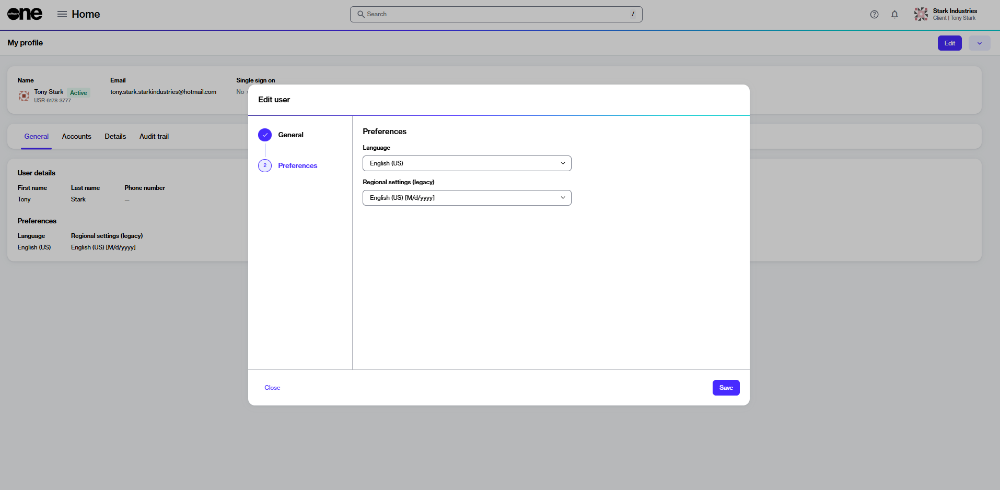

# How do I change the language in my account?

You can choose the preferred language for your account in your profile settings.&#x20;

**To change the language:**&#x20;

1. Sign in to your account.
2. Click the profile menu in the upper right and select **My Profile**.&#x20;
3. On the profile page, click **Edit**. The **Edit user** page opens.
4. Select **Preferences** and then use the **Language** menu to choose your preferred language.

<figure><figcaption>
Language preferences
</figcaption></figure>

5. Click **Save** to save your language selection.
