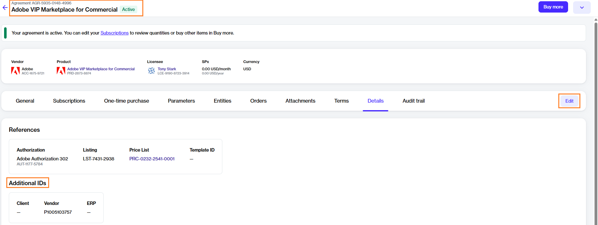

# How do you handle purchase order numbers in subscription-based models?

The landscape of B2B subscriptions and procurement processes is undergoing significant changes as businesses transition towards subscription-based models. As a result, there is a need to navigate the complexities of managing orders and invoices in the context of subscription-based procurement.

This topic aims to answer your questions about B2B subscriptions while providing an overview of how subscription-based models differ from traditional procurement processes. It also describes how the Marketplace Platform makes it easier for you to manage and streamline subscription-based procurement.


How B2B subscriptions are changing traditional procurement processes


## What is a subscription-based model?

In a subscription-based model, you pay a certain fee to access software or a service. You commit to a term and then pay a certain amount on a monthly or yearly basis.

This model differs significantly from the traditional purchasing model where you place a purchase order, the vendor processes it, and then issues an invoice after the license is allocated. &#x20;

## What are the challenges of a subscription-based model?

In traditional transactional procurement, the procurement process is linear, which means it involves placing a purchase order, processing of invoices, and reconciling them. In this model, each purchase order is directly linked to an invoice.

However, in a subscription-based model, the relationship between orders and invoices is complex. Unlike traditional procurement, where orders and invoices have a one-to-one relationship, in the subscription-based model, orders and invoices can have a many-to-many relationship.&#x20;

For example, you might place multiple orders for additional licenses in a month, but receive only one invoice at the end of the month. Alternatively, you might not place any order, yet receive an invoice for subscription renewal. In these scenarios, orders don't directly match the invoices.

This causes an issue during reconciliation due to a mismatch between the number of orders and invoices. &#x20;

## How do enterprise procurement systems support a subscription-based model?

Many enterprise procurement systems support subscription-based models through various mechanisms, such as recurring purchase orders, standing orders, blanket purchase orders, open purchase orders, contract management, and more.

Unlike traditional purchase orders, where each purchase order is linked to a single invoice, mechanisms (such as recurring purchase orders) represent long-term agreements, allowing multiple invoices to be associated with a single purchase order. This approach is useful in environments where regular, repeated purchases are common, such as in subscription-based billing systems.&#x20;

## How does the Marketplace Platform support a subscription-based model?

To explain how our platform supports this process, it's important to understand the key elements of our platform.&#x20;

The Marketplace Platform facilitates transactions between clients and vendors in various countries where SoftwareOne operates. We deal with objects such as orders, subscriptions, and agreements, which represent a relationship between the SoftwareOne entity and the client in specific regions.

* Business transactions are represented by orders, which can be of different types, such as purchase orders, change orders, and termination orders.
* Subscriptions are linked to agreements and represent the provision of service over a period of time. It's common for our clients to have multiple subscriptions within the same agreement.

To modify subscriptions, an order needs to be placed. It’s not possible to modify a subscription directly without placing an order.

Placing an order establishes a relationship at the recurring purchase order level on the procurement system's side and the agreement on the marketplace platform's side. This simplifies the reconciliation process when invoices are received because each invoice has links to the agreement, recurring purchase order, and subscriptions.

## How can I enter a purchase order number?  

You can provide recurring purchase order numbers in two ways: either when placing your order or after the order has been placed.

To provide a purchase order when placing your order, enter the number in the **Additional ID** field. This number will be referenced in all consolidated invoices in the scope of each agreement within the platform.&#x20;

<figure><figcaption>
Recurring PO
</figcaption></figure>

To provide a purchase order after your order has been placed, open the agreement and navigate to the **Details** tab. Click **Edit** and enter the value under the **Additional IDs** section.

<figure><figcaption>
Agreement details page
</figcaption></figure>

After you've provided the number, it will be displayed on the invoice. For information on the different fields available on your invoice, see [Understand Your Billing Documents](../../modules-and-features/marketplace/billing/understand-your-billing-documents.md).

## How do I update a purchase order number?

If a recurring purchase order number needs updating or changing during the subscription term, you can modify the **Additional Agreement ID** within the agreement. The updated number will then be reflected in your next invoice.


This option to update the PO number is available for the Adobe VIP Marketplace products only.

