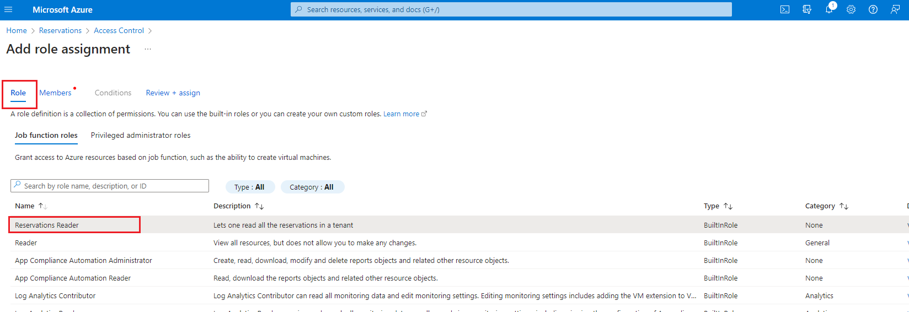

# I'm unable to view the Reserved Instance data

In some cases, the consumption data for your Azure Reserved Instances might be unavailable in the Client Portal.&#x20;

If you are not able to view the data, you must update your permissions and assign the Reservations reader role to each tenant through the Azure Portal.&#x20;

To learn about the Reservation reader role and how to assign it, see [Permissions to view and manage Azure reservations](https://docs.microsoft.com/en-us/azure/cost-management-billing/reservations/view-reservations). You can also assign the role by following the steps in this topic.

## Before you begin 

You can assign the Reservations reader role only if you have the User Access Administrator or Owner role in Azure. If you need to elevate your access, see [Elevate access to manage all Azure subscriptions and management groups](https://learn.microsoft.com/en-us/azure/role-based-access-control/elevate-access-global-admin?tabs=azure-portal).

## Assign the **Reservations Reader** role through Azure 

Follow these steps to assign the role:

1. Sign in to the [Azure Portal](https://portal.azure.com/) and search for **Reservations**.&#x20;
2. Select **Role Assignment**.&#x20;
3. On the **Access Control** page, click **Add** > **Add role assignment**. The **Add role assignment** page opens.

<figure><figcaption>
Add role assignment
</figcaption></figure>

4. On the **Role** tab, select **Reservations Reader** as the role and click **Next**. &#x20;

<figure><figcaption>
Reservations Reader role
</figcaption></figure>

5. On the **Members** tab, do the following:
   1. Select **User, group, or service principal** if it's not selected by default, and then click **Select members**. &#x20;
   2. In the **Select members** panel, type **PyraCloud** and then select **PyraCloud (Azure)** from the search results.&#x20;
   3. Click **Select**.&#x20;

<figure><figcaption>
Select members
</figcaption></figure>

6. Click **Review + assign**.
7. On the **Review + assign tab**, review the details and click **Review + assign** to confirm the role assignment.&#x20;

After you've completed these steps, the **Reservations Reader** role is assigned and displayed on the **Role assignments** tab.&#x20;

Once the role is assigned, it might take up to 24 hours for your consumption data to become available in the Client Portal. If you are not able to view the data after 24 hours, [contact us for help](../contact-support.md).&#x20;
