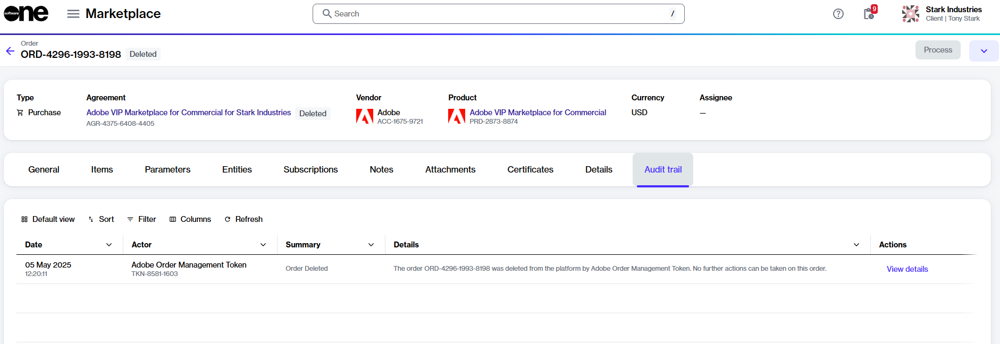

# My draft or quoted order has been deleted

In the Marketplace Platform, only one order per agreement can be processed at a time.

To avoid conflicts, any orders in [draft or quoted states](../../modules-and-features/marketplace/orders/order-states.md) are deleted automatically when another order under the same agreement is processed. This ensures that no concurrent changes are made to subscription items and licenses.&#x20;

If your order has been deleted by the platform, you can find confirmation of its deletion in the **Audit trail** tab within the [order details page](../../modules-and-features/marketplace/orders/#subscription-details). The following image shows an example:&#x20;

<figure><figcaption>
Audit trail tab
</figcaption></figure>

Once an order is deleted, it cannot be recovered, and no further action can be taken on that order.
