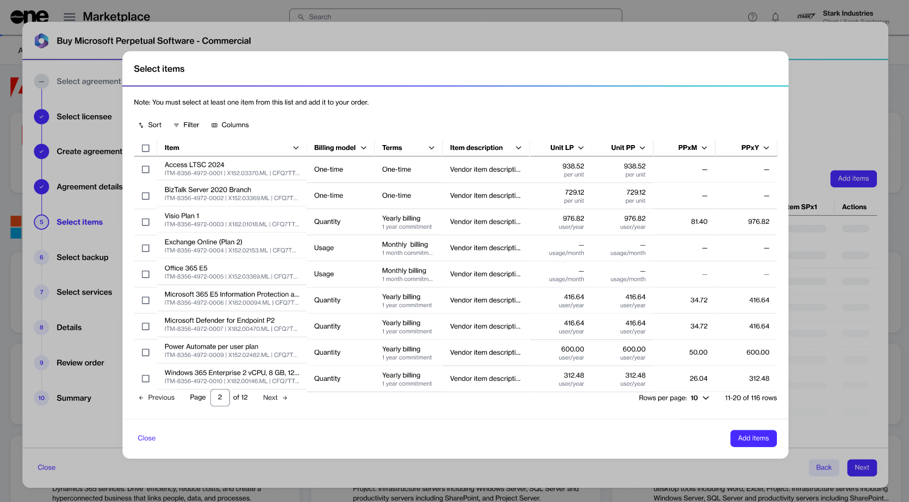

# What billing models does Marketplace support for items?

The SoftwareOne Marketplace Platform currently supports three billing models that determine how you are charged for an item. These include usage-based, quantity-based, and one-time billing models.&#x20;

For all items in the Marketplace, the billing model is shown on the [Items page](../../modules-and-features/catalog/items.md) within the platform and in the **Items** step during a purchase order or a change order workflow.&#x20;

<figure><figcaption>
The Select items step showing billing models when creating a purchase order.
</figcaption></figure>

### Usage‑based billing 

Usage-based billing means you are charged based on actual consumption of a product or service. This model is also known as pay-as-you-go. In this model, your usage is calculated and billed at the end of your billing period or commitment term.&#x20;

In the Marketplace Platform, usage‑based billing applies to consumption‑based products sold as subscriptions, such as Microsoft Azure, FinOps for Cloud, AWS, and more. Products that are usage‑based clearly indicate this model during the purchase process.

For usage-based subscriptions, you cannot change the quantity after purchase, as you are billed according to actual usage, rather than a predefined quantity.

### Quantity-based billing

Quantity-based billing means you are charged based on the number of licenses you purchase.&#x20;

During the purchase process, you select the quantity, and at the end of your billing period or commitment term, you are billed according to the total quantity purchased.

In the Marketplace Platform, quantity-based billing applies to subscription-based products, such as Microsoft 365. This billing model is clearly displayed during the order workflow and on the [subscription details](../../modules-and-features/marketplace/subscriptions/#subscription-details) page once the order completes.&#x20;

For quantity-based subscriptions, you can adjust the quantity at any time by adding or removing licenses as needed.&#x20;

### One-time billing

In this model, you make a single, non-recurring payment for indefinite use of the product.&#x20;

This payment grants you a perpetual license, allowing you to use the software indefinitely. Once purchased, the license doesn't require any recurring payments or renewals.&#x20;

In the Marketplace Platform, perpetual licenses purchased through one-time billing are managed via [Assets](../../modules-and-features/marketplace/assets/).
