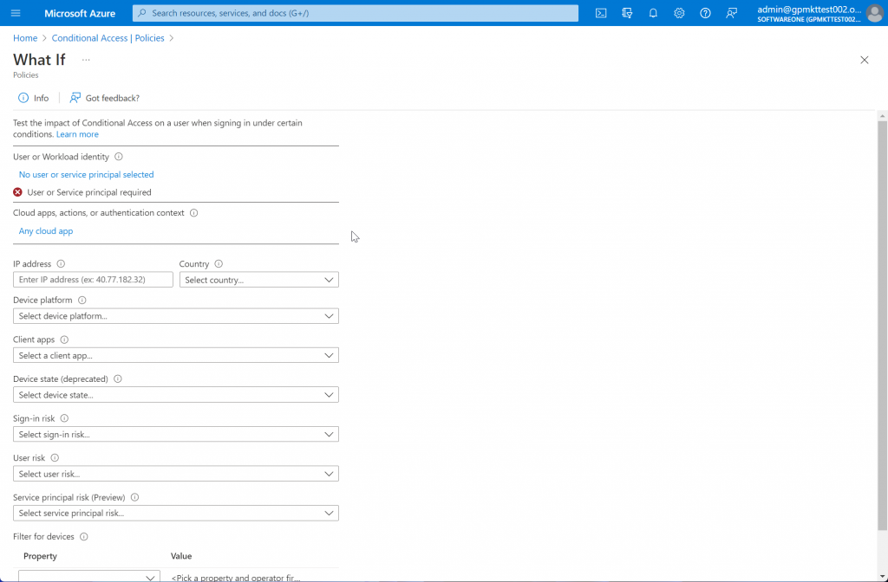
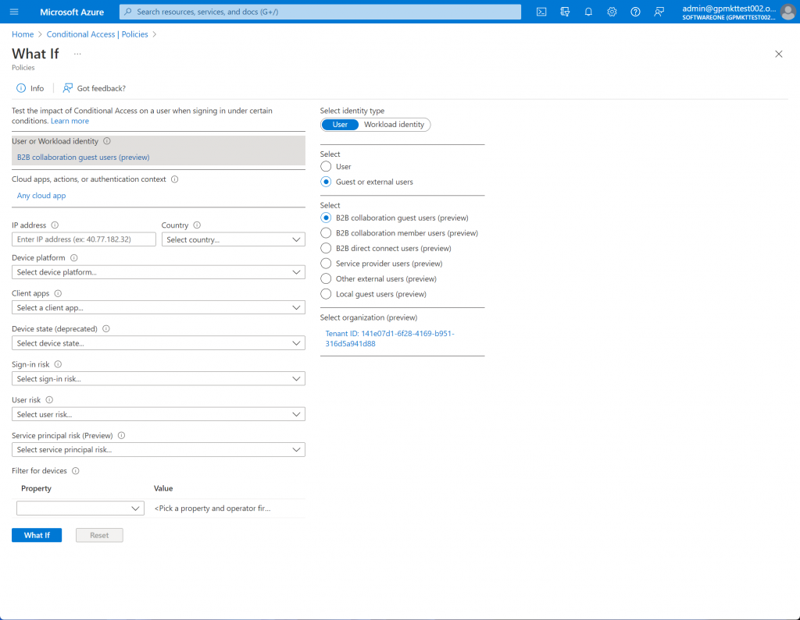

# How to configure conditional access policies

Microsoft has released a preview feature to support allowing access to service providers (like SoftwareOne) through Conditional Access policies. To learn about Conditional Access, see the [Microsoft documentation](https://learn.microsoft.com/en-us/azure/active-directory/external-identities/authentication-conditional-access#conditional-access-for-external-users.).&#x20;

***

### Prerequisites 

To exclude SoftwareOne and the Client Portal from your blocking Conditional Access policies, you'll need the Microsoft Tenant IDs of SoftwareOne’s reseller tenants that relate to you.&#x20;

Even though SoftwareOne has over one hundred of these reseller tenants, only one or two will apply to you. The only way to find out the reseller tenant IDs you need to use is to log a support ticket with our Support team.

***

### Configuring conditional access policies 

For configuring conditional access policies, determine which Conditional Access policies are blocking SoftwareOne and the Client Portal.&#x20;

Before you can exclude Client Portal and SoftwareOne from your policies, you need to know exactly which policies are affecting access. You can do this using the **What If** capability of Conditional Access.

**To configure conditional access policies**

1. In the Azure portal, navigate to [Azure AD Conditional Access](https://portal.azure.com/#view/Microsoft\_AAD\_ConditionalAccess/ConditionalAccessBlade/\~/Policies).&#x20;

<figure><figcaption></figcaption></figure>

2. Select **What If** in the top navigation bar.&#x20;

<figure><figcaption></figcaption></figure>

3. On the What If page, select **No user or service principal selected** and then choose the following settings:
   1. Select identity type: **User**
   2. Select: **Guest or external users**
   3. Select: **Service provider users (preview)**
   4. Select organization (preview)
      * Click **No Tenant selected.**
      * Enter the Tenant ID you obtained from our Support team.
      * Click the tenant that is found.
      * Click **Select**.

<figure><figcaption></figcaption></figure>

4. Select **What If**.

At the bottom of the page, you will see the list of **Policies that will apply**. Make a note of these policies as these are the ones you will need to modify to exclude the Client Portal and SoftwareOne.

<figure><figcaption></figcaption></figure>

***

### Excluding the Client Portal and SoftwareOne from the policy 


When modifying Conditional Access policy exclusions, do not remove any of your existing excluded users, groups, or other principals. With Conditional Access, there is a very real possibility of locking yourself out of your tenant. Only attempt the following steps if you are a Conditional Access expert and you are confident configuring them.

SoftwareOne cannot be held liable for damages caused by the misconfiguration of this feature.


1. In the Azure portal, navigate to [Azure AD Conditional Access](https://portal.azure.com/#view/Microsoft\_AAD\_ConditionalAccess/ConditionalAccessBlade/\~/Policies).

<figure><figcaption></figcaption></figure>

2. In the list of policies, select one of the policies that you applied.

<figure><figcaption></figcaption></figure>

3. Under **Assignments**, select the **Users** section.&#x20;

<figure><figcaption></figcaption></figure>

4. Select **Exclude**.

<figure><figcaption></figcaption></figure>

5. Select the **Guest or external users** checkbox.&#x20;

<figure><figcaption></figcaption></figure>

6. Choose **Select**.&#x20;

<figure><figcaption></figcaption></figure>

7. Click **0 Azure AD organizations selected**.&#x20;

<figure><figcaption></figcaption></figure>

8. Enter the Tenant ID you obtained from our Support team, and then select the checkbox next to the SoftwareONE reseller tenant.&#x20;

<figure><figcaption></figcaption></figure>

9. Click **Select** and then select **Save.**&#x20;

<figure><figcaption></figcaption></figure>

Repeat the steps in this section for each policy that you noted in the previous section.


**NOTE**: At this point, you may wish to temporarily change the policy to **Report-only** to check whether existing access is still working correctly. If you do this, please remember to enable the policy again once you are confident it is working as expected.

