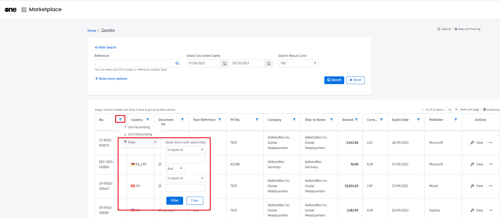
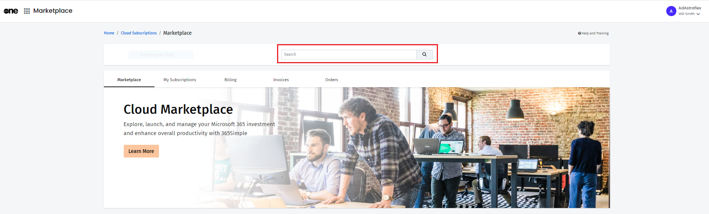
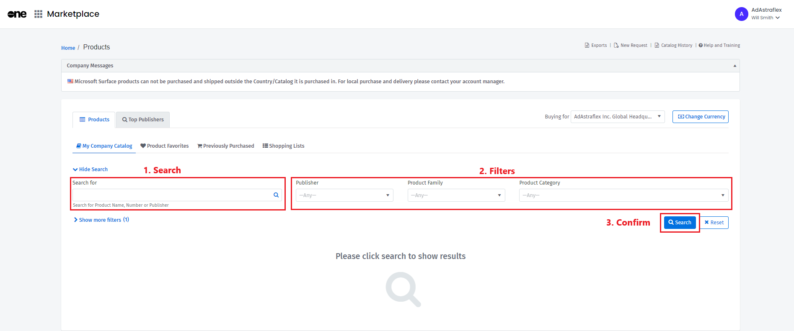

# How to search in the Client Portal

## I'm unable to find the Global Search Bar in the Client Portal.

In PyraCloud, a Global Search Bar was available at the top of all pages to allow you to quickly find your software transactions, products, services, and cloud subscriptions.

In Client Portal v1, the Global Search Bar is removed to make the interface more straightforward and easier to use.

Now, instead of the Global Search Bar, you can use the search filters to find specific information based on your search criteria. &#x20;

## How do I find my quotes, orders, and invoices in the Client Portal?

You can use the search filters to find the information you need. For instructions on how to use the filters, watch the following video tutorial.



The search filters are available on a number of pages to help you narrow down your results, regardless of the amount of data. You can search by an exact single keyword or multiword.&#x20;

As several pages in the Client Portal present data in a table view, each column header also includes filters enabling you to sort and refine your data even more.&#x20;

Selecting the filter iconin each column header displays the filter box for that column. Choose the conditions that match your criteria and then select **Filter** to view results.&#x20;

<figure><figcaption>
Filters
</figcaption></figure>

## I frequently used the Global Search Bar in PyraCloud to locate my orders and invoices. How do I find these quickly in the new portal?

If you access some pages regularly to locate data, we recommend you mark those pages as your favorite and then use the search functionality and available filters.

[Favorites](../../platform-basics/profile-settings/manage-favorites.md) is a new feature, which allows you to quickly access your frequently visited pages from the home page as well as through the **Favorites** option in the main menu.

## How do I search for Cloud Subscriptions?

If you have access to our Cloud Subscriptions module, you can search for Microsoft 365 or Azure subscriptions from the Cloud Subscriptions page (**Marketplace** > **Cloud subscriptions**).

**To find a subscription**

1. Type a keyword in the search box. The search results are displayed as you type.
2. Select the search result or press **Enter** to view a list of available subscriptions.

<figure><figcaption>
Cloud Marketplace
</figcaption></figure>

## How do I search for products and services?

You can search for a product or service directly from the Products page (**Marketplace** > **Products**).

**To find a product or service**

1. Type the product name, number, or publisher in the search box.
2. If required, use the Publisher, Product Family, and Product Category filters to narrow your search results. You can also apply advanced filters by selecting **Show more filters**.
3. Select **Search**.

<figure><figcaption>
Search filters
</figcaption></figure>

## Will you add a Global Search Bar to the Client Portal?

As part of our roadmap, we are developing new features and hope to introduce enhancements that will make your product experience more seamless and friendly.

Please stay tuned for our upcoming product releases and updates.
