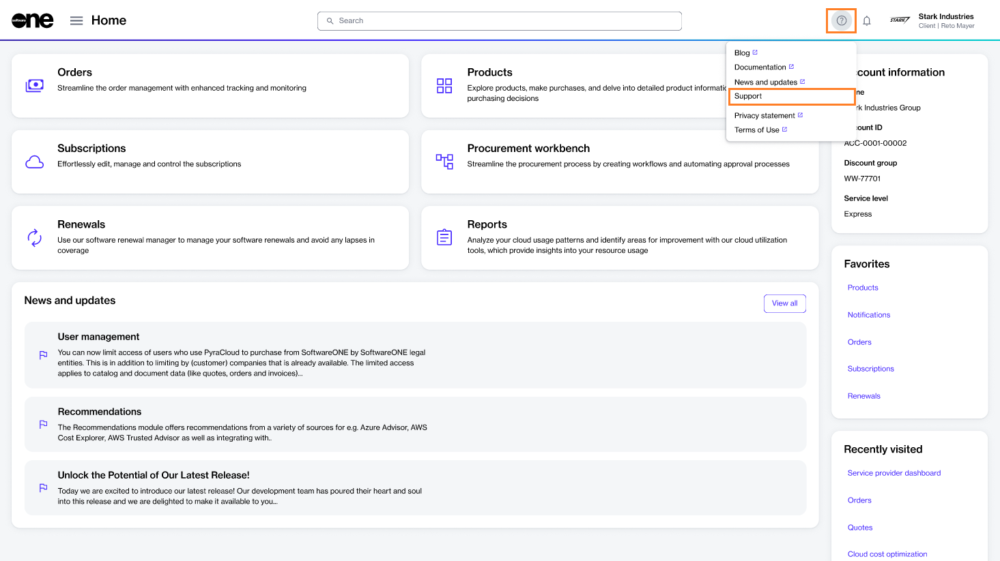

# Contact Support

Before contacting the Marketplace Support team, note the following points:

* Please submit your query in English to ensure we can assist you effectively.
* Consider browsing our [Frequently Asked Questions](faqs/) to see if your question has already been answered. You can also check out our [Adobe](../extensions/adobe-vip-marketplace/tutorials-and-videos/) and [Microsoft CSP](../extensions/microsoft-csp/tutorials/) tutorials for step-by-step guidance on ordering and managing subscriptions.
* For help with your password or user management, see [Update Password](../getting-started/platform-overview/basics/update-password.md) and [Settings](../platform-modules/settings/).

If you still need assistance, you can contact us through email or create a ticket through the platform. &#x20;

## Contact us through email

You can contact us through email at [marketplace-support@softwareone.com](mailto:marketplace-support@softwareone.com).&#x20;

## Create a ticket

You can create a ticket for our Support team from the **Help and Support** page of the platform. Follow these steps to create a ticket:

1. Sign in to your account.
2. Click the help icon in the header and select **Support**. The **Help and Support** page opens.

<figure><figcaption>
Support option in the Help menu
</figcaption></figure>

3. On the **Help and Support** page, click **Submit a Ticket**.
4. Fill out the form according to your issue. Optionally, click **Select files** to upload documentation that might help us understand and resolve your problem quickly.
5. Click **Send**.&#x20;

A confirmation message is displayed stating that your ticket has been created. If the **Send** button is unavailable, make sure you've entered the required information.
