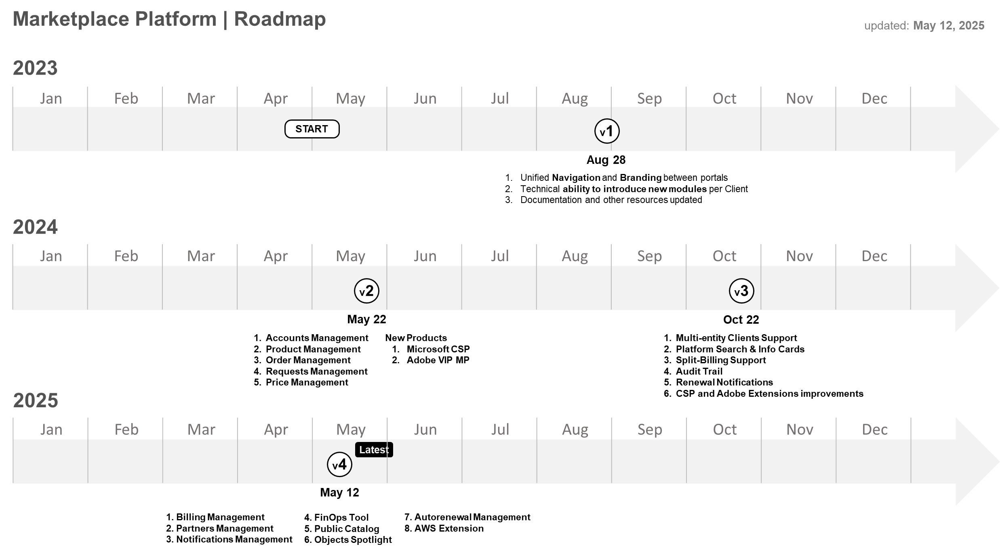

# Release Notes

<figure><figcaption></figcaption></figure>


[release-notes-v4.md](release-notes-v4.md)



[release-notes-v3.md](release-notes-v3.md)



[release-notes-v2.md](release-notes-v2.md)



[release-notes-v1.md](release-notes-v1.md)

