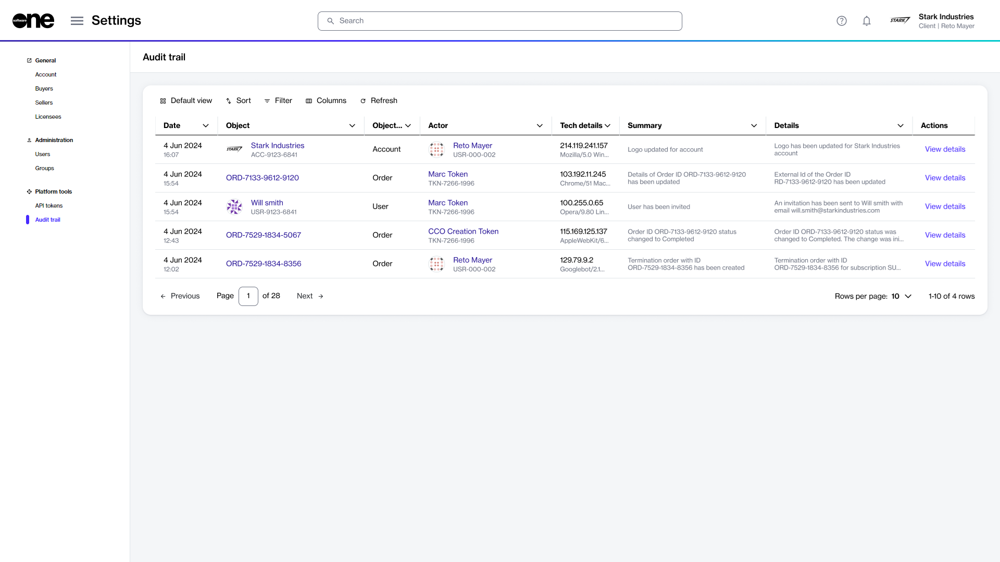

# Release Notes v3

**Release Date: 22 October 2024**

We are pleased to announce the v3 release of the Marketplace Platform. This release includes a range of new features, designed to improve usability and streamline your experience.

Watch the following video or continue reading to learn about this release:


What's new in SoftwareOne Marketplace Platform v3


## Audit Trail

To increase accountability and transparency, we have introduced the Audit Trail feature. This feature allows you to view all events that have occurred within your account. It provides a detailed record of each event, ensuring complete visibility. You can access this feature through the **Settings** menu. 

<figure><figcaption>
Audit trail page
</figcaption></figure>

The audit trail is now also available at the object level in the platform. To support this, a new tab called **Audit Trail** has been added to the details pages of the key objects such as orders, agreements, and subscriptions. This tab displays all events associated with the specific object. To learn more, see [Audit Trail](../../modules-and-features/settings/audit-trail.md).&#x20;

<figure><figcaption>
Audit trail tab on the order details page
</figcaption></figure>

## Adjustable Column Widths

We've added new options to the **Columns** selector, which is available in the data grids across the platform. These options allow you to adjust the width of the columns and control how the data is displayed on a page.&#x20;

<figure><figcaption>
Columns selector on the Orders page
</figcaption></figure>

* **Default size** - Resets each column in the table to its default size. This option can be used if you've made adjustments and wish to return all columns to their original state.&#x20;
* **Fit to content** - Resizes each column in the table to fit its specific content. It means that the width is adjusted to the content within the column.&#x20;
* **Fit to screen** - Resizes each column so that the entire table fits your screen.

To learn about the other operations in the data grid, see [Customize the data grid](../../marketplace-platform/getting-started/interface/customize-the-data-grid.md).

## Buyer-Level Group Restrictions

The Marketplace Platform now includes a feature that allows administrators to restrict user groups to specific buyers. When creating new groups or modifying existing ones, administrators can choose whether the group of users can see all buyers in the account or only selected buyers.&#x20;

With this feature, administrators can ensure that certain users have restricted buyer visibility while others have full access. It's important to note that buyer-level restrictions only apply to the Marketplace module in the platform. To learn more, see [Restrict Group to Certain Buyers](../../modules-and-features/settings/groups/restrict-group-to-certain-buyers.md).

## Information Cards

Information cards are now displayed for the key objects in the platform. Information cards appear when you hover over a link, such as the order ID or username.&#x20;

These cards display key properties, allowing you to view the important information in one place without leaving the page. To learn more, see [View Information Cards](../../marketplace-platform/getting-started/interface/view-information-cards.md).

<figure><figcaption>
Information card on the Orders page
</figcaption></figure>

## Microsoft CSP Renewals Management

To keep you informed about your subscriptions, the platform now sends automated email notifications when your Microsoft CSP subscriptions are nearing expiration. This feature makes it easier for you to renew your subscription through self-service.

The renewal notifications are sent 1, 7, and 30 days before your subscription ends. The notifications contain the **Manage Subscription** option, which allows you to enable autorenewal for your subscription. To learn more, see [Renewal Management](../../extensions/microsoft-cloud-solution-provider/renewal-management.md).

<figure><figcaption>
Renewal notification
</figcaption></figure>

## New Buyer Status

A new status type called **Mismatch** has been added for the buyers on the platform.&#x20;

Buyer statuses are displayed on various pages, including the main **Buyers** page and the details page. The new **Mismatch** status is displayed if there's a discrepancy between the buyer’s data on the platform and our backend system. To learn more, see [Buyers](../../modules-and-features/settings/buyers/).

## Search Functionality&#x20;

We've added a search functionality to the platform to enhance your experience.&#x20;

The new search bar is located in the header and it lets you search for your orders, subscriptions, products, and more. The search bar is always visible and can be accessed from any page on the platform.&#x20;

<figure><figcaption>
Search functionality in the platform
</figcaption></figure>

You can also use search to find product documentation. To learn more, see the [Search ](../../marketplace-platform/getting-started/interface/#search)section in [Platform Interface](../../marketplace-platform/getting-started/interface/).

## Split Billing for Adobe VIP Marketplace 

Previously, in the Marketplace Platform, the billing for a subscription was allocated to a single buyer in your account. It wasn't possible to divide the billing across buyers. This caused problems for our clients with multiple legal entities, as they were unable to break down the invoice and assign subscription costs to the right entity.

Now, we have introduced the capability for you to allocate billing to different buyers in your account. This can be done by activating split billing for an agreement, choosing buyers, and then specifying the allocation percentage or license count for each buyer.&#x20;

Billing can also be allocated when ordering additional licenses as part of your agreement. To learn more, see [Split Billing](../../modules-and-features/marketplace/billing/) and [How to Split Billing Across Buyers](../../marketplace-platform/getting-started/marketplace-for-clients/how-to-split-billing-across-buyers.md).

## Updated Design System

Earlier this year, we launched the [SoftwareOne Design System](https://design.platform.softwareone.com/1233aa9e6/p/521ab9-softwareone-design-system), a comprehensive framework that includes our design principles, guidelines, and components. This system is designed to facilitate a unified and consistent experience for different users of the Marketplace Platform.

Since its launch, we've continuously refined our design system to enhance its effectiveness. To view a complete list of modifications, [see the changelog](https://design.platform.softwareone.com/1233aa9e6/p/67ff30-change-log).
